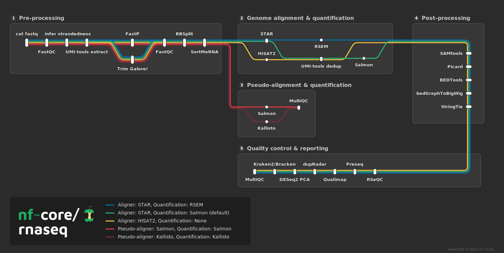
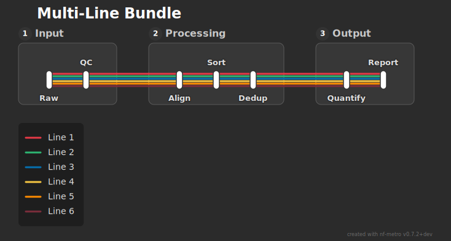
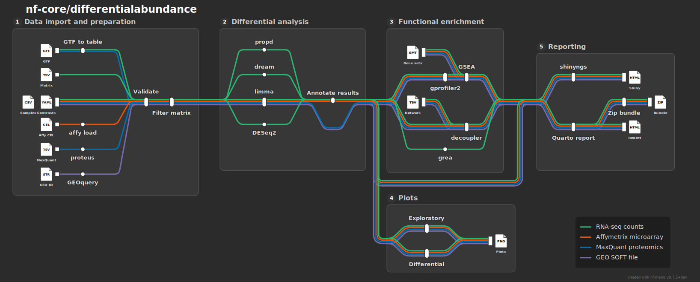
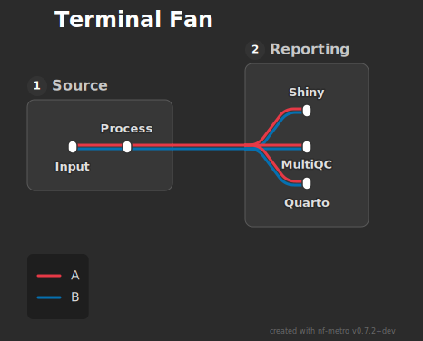

# Adventures in AI-driven development: nf-metro

There's a lot of coverage of AI-driven development right now, and broadly it seems to fall into 2 buckets:

- AI tooling is frickin' awesome and will make us all obsolete tomorrow
- AI is making us all stupid and unable to write and review good code any more

nf-metro has been my side project for a few months now, built almost entirely by AI, and working on it has shown me the limitations of both of those viewpoints. Here's what I've learned and where I think we're going, with links into the code wherever I make a concrete claim.

## Metro maps and workflow visualisation: a problem AI can't solve

The people who write maps to help humans navigate metro systems throw a whole bunch of detail out the window, so that the layout you see bears almost no resemblance to the geography on the surface. But what they do really well is help you understand how to get from place A to B. The nf-core community stole this trick years ago, and many nf-core pipelines now display a 'metro map' of their own. They're explicitly NOT (in most cases) a literal representation of the workflow graph, that would involve a lot of accessory processes that tell a reader little about the scientific logic embodied in the pipeline. Instead, the metro map is a distilled form of the pipeline's logic designed to communicate that scientific message to readers.

*The nf-core/rnaseq pipeline as a metro map. Each coloured line is one route through the pipeline; stations are the analysis steps; sections group the stages. nf-metro drew this from a short text description, no dragging required.*

Since I started working in nf-core I've gained responsibility for a couple of pipelines, and love the metro philosophy. Just one problem: I HATE graphics software. Nothing against all you graphics designers out there, I just do. All that dragging elements around, getting things arranged just so, manually, it drives me nuts. So I set out on a mission: surely this can be automated?

## Turns out layout is hard

As it happens, I'd missed something obvious to a lot of folks: layout algorithms are hard. Representing a metro map conceptually is easy (this thing connects to that other thing, these things should be grouped). Arranging those things in an attractive way on a canvas is distinctly non-trivial, what I thought might be a weekend project or two has turned into a bit of an obsession, which I'm still working on months later. But the ongoing development process has taught me a bunch about how to do software development with AI, and how different it is relative to the process before.

## I don't need to understand all the code

This is the bit both camps get wrong, in opposite directions. The agent wrote most of this codebase. At one point it took an 8,800-line layout engine and split it into a [tidy subpackage of separate phases](https://github.com/pinin4fjords/nf-metro/tree/89267a077dd64d98b46cedad8307ac58f81ff81d/src/nf_metro/layout/phases). Another week it tore out the entire parser and replaced it with a [proper grammar](https://github.com/pinin4fjords/nf-metro/blob/89267a077dd64d98b46cedad8307ac58f81ff81d/src/nf_metro/parser/grammar.py). I reviewed the shape of those changes, the interfaces, the approach. I did not read every line, and I'm not going to pretend I did.

You can read that two ways. One camp says: see, the machine does it all now. The other says: see, he doesn't even understand his own code any more. I think both miss the point. Not reading every line is only fine if you've built something that tells you, loudly and automatically, the moment a line is wrong. Without that it's reckless; with it, it's just delegation.

So the real story of this project isn't the code the AI wrote. It's the scaffolding I had to build so I could trust code I hadn't read. That turned out to be where all the interesting work was.

## Trust, but make the build prove it

nf-metro boils down to a few dozen steps that run in order to arrange stations and connecting lines on the canvas and apply a set of heuristics that stabilise things towards something I've defined as visually attractive. So, stations should be no closer than some minimum, labels shouldn't clash with other elements, and so on. But everything depends on everything else. If I move a station apart from another to allow label space I might, for example, compress a diagonal rail segment to an unattractive angle, or make one station overlap another. Eyeballing the result and hoping was never going to work, so the answer is the same as it's always been in software: encode the checks and run them in CI.

That part isn't new. What the AI changes is what those checks are for. They've stopped being a backstop against the occasional regression and become the place I write down the taste the AI hasn't got (more on that later): stations belong on straight track, labels mustn't collide, lines that run together should bend as one. Every one of those is something a human collaborator would simply know and the AI simply doesn't, so it has to live in code, where it fails the build in the AI's own loop rather than waiting on me, especially when the AI turns out plausible-looking changes far faster than I could ever check by hand. The very best checks go a step further and make the bad thing impossible to express at all, so the AI can't even reach for it, but that's the ideal; mostly I settle for a rule that screams the instant it's broken.

One example is a [check I called "stations as elbows"](https://github.com/pinin4fjords/nf-metro/blob/89267a077dd64d98b46cedad8307ac58f81ff81d/tests/layout_validator.py#L776-L791). In my head at least, metro maps never put stations on right-angle corners; the stations sit on straight bits of track, with the curves in between. But early on the engine kept wanting to use station nodes as the inflection points, because it made its job easier. After correcting it for about the tenth time, I added a check that flags it as an error, and I've barely seen an elbow station since.

A check like that just shouts when something's wrong. The stronger move, when I can manage it, is to arrange the code so the mistake can't be expressed in the first place. Curves are my best example. For a long time every bend in the engine had its radius worked out by hand wherever it was drawn, with the direction of the turn picked by whoever happened to be writing that bit of code. Get the sign wrong and the curve pinches; worse, a bundle of lines that should sweep round a corner together would fan apart and cross over. Recently I pulled all of it into one place: a route now just describes the centreline it wants to follow, and a [single builder](https://github.com/pinin4fjords/nf-metro/blob/89267a077dd64d98b46cedad8307ac58f81ff81d/src/nf_metro/layout/routing/bundle.py#L66-L109) fans the individual lines out as parallel offsets of that line, working out every corner from the geometry. Nobody writes a radius or a direction by hand any more, so a bundle physically can't pinch or cross, there's simply no code left in which that mistake can be written down. The whole class of bug didn't get caught, it stopped existing.

*Lines that travel together are drawn as parallel offsets of one centreline. Because no individual line picks its own radius or turn direction any more, the bundle physically can't pinch or cross itself.*

Other checks are harder to automate, or at least hard to encode in something the Python code can verify on its own. And sometimes I just failed to anticipate a problem at all. For those cases I lean on a check of the end product itself: the rendered metro maps. As I've worked on nf-metro I've built up a [big library of topologies](https://github.com/pinin4fjords/nf-metro/tree/89267a077dd64d98b46cedad8307ac58f81ff81d/examples/topologies), example layouts that each exercise a particular arrangement of tracks and stations. Every time I open a pull request, [the GitHub CI](https://github.com/pinin4fjords/nf-metro/blob/89267a077dd64d98b46cedad8307ac58f81ff81d/.github/workflows/pr-renders.yml) works out which of those examples the change touches and produces a report with a before-and-after render for each one. Sometimes the changes are good, sometimes they're bad, but a quick scroll up and down tells me the impact, and I can have the AI refine the bits that need it. Often a check turns out to be automatable after all, but I'd only have known to write it because of that graphical review. I guess it's really user acceptance testing: you don't always know enough up front to lean on automated tests alone.

*Another real pipeline, nf-core/differentialabundance. Maps like this one go into a library of examples; every pull request re-renders the ones it touches so I can eyeball the before-and-after.*

So we have 3 ways of bending the AI to our will: we can make it literally impossible for it to make the mistakes we identified, we can make the code scream when it makes the mistake, and we can make sure the pointy end of the product is highly visible to the human overseer.

The first two of those, the make-it-impossible and the make-it-scream, share a discipline I think of as a ratchet: the checks only ever accumulate, and the bar only ever moves up. Once a check is in, it stays in, so the thing it protects can't quietly slide back later. My favourite version is a little trick for bugs I haven't got round to fixing yet. I write a test for how the thing should behave, then [mark it as expected to fail](https://github.com/pinin4fjords/nf-metro/blob/89267a077dd64d98b46cedad8307ac58f81ff81d/tests/test_layout_invariants.py#L446-L456). While the bug's still there everything stays green and nobody panics. But the day someone actually fixes it, that test starts passing, and because it was supposed to fail, the build goes red and makes them notice, so they have to retire the old expectation and lock the correct behaviour in. The floor can't slip backwards by accident, because slipping backwards is itself a broken build. The strongest rung is that impossible-by-construction one: there's nothing to slip back to, because the bad layout simply can't be built.

None of this is glamorous, but it's the only reason I'm happy letting the AI do most of the typing without reading every line it writes.

## The machine has no taste

My 'product' here is a nice exemplar of something an AI can't figure out by itself. It's novel, the rules for getting it right are non-obvious. I think that bodes well for humans in future: AIs are trained on the body of current human knowledge, if something is new (and all the fun things are, right?), the AI is never going to be able to take the driving seat.

That sounds abstract, so here's how it shows up in practice. The AI is perfectly good at laying out a graph; what it can't do is decide whether this particular map is any good. And "good" here is the same editorial call I started with, what to throw away so the scientific story reads clearly, which isn't a problem it can look up. There's no canon of well-drawn pipeline metro maps sitting in its training data; the standard lives in my head, not in the text it learned from. So it turns out plausible-looking layouts that are quietly wrong and has no way of telling which is which. And I don't think that's a limitation it grows out of next year; it's structural, you can't train on a standard that doesn't exist yet.

*The kind of thing only an eye catches: this fan reads as "right" because it's balanced. A lopsided version would pass every automated check and still look wrong, and only a human looking at it would know.*

You can see the same split in who caught what over the months. I caught the things that needed an eye for the form: the fan of branches that came out lopsided, the line breezing past a station it was meant to serve, the layout that passed every check and still looked off. The AI caught the things that are well-trodden and mechanical: the missing type annotation, the test pointing at something that no longer exists, the function that had quietly [swollen to forty-odd branches](https://github.com/pinin4fjords/nf-metro/blob/89267a077dd64d98b46cedad8307ac58f81ff81d/pyproject.toml#L70-L76). That division isn't a coincidence. It's strong exactly where the problem has already been solved a thousand times in its training, and weak exactly where it's novel, which is the half I find interesting anyway.

And this isn't really about metro maps. A metro map just happens to be my version of it. The same goes for anything where the definition of "good" is one you've set yourself and that isn't already sitting in the corpus the model trained on: the feel of a new game, the house style of a bespoke tool, the shape of a method nobody's published yet. Where the standard predates the AI, it can lead. Where you invented the standard, you're the one who has to hold it. The AI can do the typing, but it can't tell you whether the result is the thing you meant.

Which is why the before-and-after renders matter as much as they do: they're the channel that puts the novel judgement back in front of the only thing that can make it, a human looking at the picture. And once that judgement is one cheap glance away, you stop being precious about your ideas. I've opened pull requests I never meant to merge, just to see the diff and decide, then closed them an hour later. None of it was wasted; it's exploration at a price you can actually afford.

## It'll lie to you with a completely straight face

None of this will be news if you've spent any time with these tools. But the familiar failure modes change how you have to work, so they're worth being deliberate about. The big one: assume the AI is handing you a tidy story, and make it prove otherwise.

Start with the cheerful one: it writes up everything as a success, and that shows up in ways that matter. When it rewrote the parser, the plan said the file would shrink from about 700 lines to about 200. It did not. It GREW, by about ninety lines. Left to itself the write-up would have been "parser modernised, great success"; the honest version was "this got bigger, here's why, and here's the actual benefit you're buying with those extra lines". You have to drag that second version out of it.

The one that costs you more is confident fabrication, the same hallucination everyone talks about, just pointed at your own codebase. An agent once explained, in convincing detail, why a particular branch of code could never run. It was fiction; I found out by instrumenting the code and watching the branch fire on the first run. The rule that came out of it: when the AI tells you how something behaves, go and watch it actually run before you take its word for it.

And it loves to tidy up things that look like mess but are actually holding the roof up. The old parser silently threw away any line it didn't recognise, which looks like a sloppy wart worth removing. Turns out real tests depended on it: hand the tool a garbage file and it should quietly produce an empty result, not fall over. So the thing I'd written off as a wart was actually doing a job. The agent couldn't know that, because it didn't live through whatever made someone add it in the first place. Only the tests knew. Which is, once again, the whole argument for the tests.

The cheering flip side is that, with software, you can usually make the AI prove its assertions to itself. If a person swears blind that a branch is dead, you either take it on trust or go and check yourself; the AI you can just hand the evidence. Write the instrumentation, or the test, or the invariant, and let the result do the arguing. "Trust me" turns into "run it and see", and because the AI is running it in its own loop, it usually notices it was wrong and fixes it before the change ever reaches me. The fabrication matters far less once the thing doing it can be made to check its own homework against something that won't play along.

## So what do you actually do all day?

The fear underneath the "AI makes us stupid" camp is that if you stop writing the code, your brain goes soft. I don't think that's what happens. You don't stop thinking. You stop thinking about the SAME things.

The work moved up a level. I spend almost no time now on "how do I write this loop" and almost all of it on "is this the right shape for the problem", "what's the invariant that would have caught this", "is the agent about to break something three files away where I'm not looking". Different muscles, and honestly the harder ones. The typing was never the interesting part of the job; it was just the part that used to eat the hours.

It also grew some new chores that didn't exist before. When I trip over an unrelated bug mid-task, I don't chase it (that's how you blow up an afternoon) and I don't make a mental note (that's how you forget it). I file a proper, detailed issue then and there and carry on. The issue becomes the memory, written for whoever picks it up, which is usually either me in a fortnight or an agent with no recollection of any of this. That's a new discipline the tooling quietly demands, file rather than chase. It's not hard, but nobody warns you about it.

## Where I think this is going

So, the two buckets I started with. Neither one survives a few months of actually doing this.

It is not going to make us obsolete tomorrow. It can't see when the map looks wrong, it'll happily make up a story about why the code works, and it'll try to tidy away the odd bits of code that are quietly doing a job. Left to its own devices, it's a very fast way to produce plausible rubbish.

It is not making us stupid either. It moved the thinking up the stack, from typing toward deciding what "correct" even means and building the machinery that enforces it. That's more demanding, not less. Which is roughly where I think this is heading: not humans squeezed out, but humans holding the standard on whatever's genuinely new while the AI takes care of the well-trodden middle. The novel stuff stays ours for as long as it's novel, which, happily, is where the fun is anyway.

The thing I keep coming back to is that the code the AI wrote turned out to be almost the incidental part. The real work was the harness around it: the tests, the ratchets, the render diffs, the habit of letting a red build be the thing that stops me. That's what let me trust thousands of lines I never read, and it's the part I'll take to the next project, long after I've forgotten how this layout engine actually works. The metro maps just turned out to be a good way to learn it.
