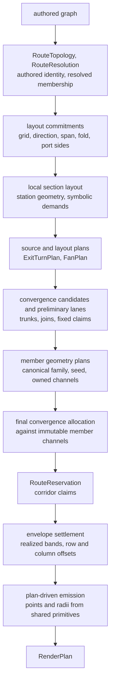
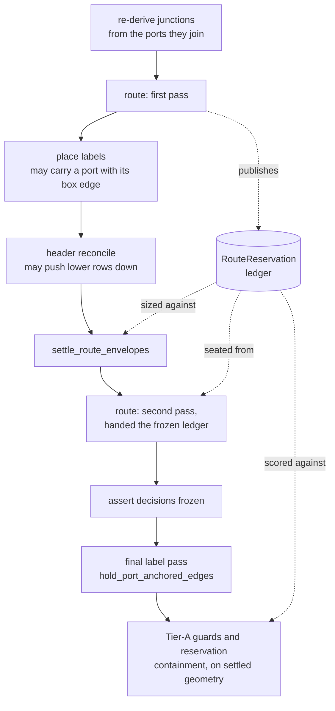
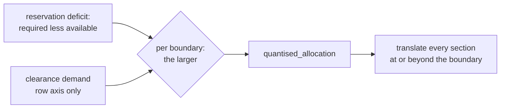

The route plan is an immutable description of the semantic route systems that reach production routing.
It answers four questions:

1. Which authored connectors belong to the same route system?
2. Which physical resolved legs represent that system?
3. How did production routing emit, cover, or reject each leg?
4. Which source turns and target convergences were committed before emission?

The plan holds both decisions and observations.
Exit-turn records choose the source lanes, run direction, turn direction, shared axes and runway demand for a complete exit group.
Convergence records choose the target trunk, feeder landings, continuation and endpoint ownership.
Emission bindings and corridor reservations describe what production routing finally emitted.

## Who owns what

Each stage that follows decides one thing and freezes it for the next.
The chain exists to enforce one rule.
A visual object spanning several edges is decided once, at the scope of the invariant it has to keep, rather than rediscovered per edge and repaired afterwards.

Names change, but the boundaries do not.
A stage never reaches back.
Emission does not choose a band, settlement does not choose route membership, and no later pass restores something a plan owns.

## Observation boundary

On the normal routing path, the routing context and semantic scaffold are built before the first production path is emitted.
Ordinary routing and `observe_route_edges` run the same exit-turn, fan, convergence-classification, route-system, member-geometry and final convergence-settlement stages.
Each inter-section member is classified once, and each `RouteSystem` receives one emission disposition before any of its members are emitted.
Ordinary routing returns only the routes.
It constructs no `RoutePlanObserver`, no emission bindings, no corridor reservations and no final `RoutePlan`.
`observe_route_edges` collects and returns those additional records.

`RouteSystemEmissionExecution` follows the scaffold's canonical system order and emits a system once, in that system's canonical member order.
After preliminary system disposition, a planned non-convergence member's frozen family builds one `RouteMemberGeometryPlan`.
The plan stores the pre-normalization points and radii, gap and trunk slots, offset regime, normalization policy, semantic plan references, and the exact segment identity and coordinates of every gap channel it owns.
Production copies that seed into a fresh mutable route, and neither calls the family nor runs the ordered matcher again.
A complete convergence plan owns its members directly.
Every production system is planned, and routing fails closed if a member has no geometry owner.

Every emitted system member carries its route-system ID, emission-member ID, system disposition, owning plan IDs and claimant-exact reservation IDs on the final `RoutedPath`.
Declined child-planner verdicts remain as superseded diagnostics rather than selecting another emitter.
Rail members record the rail family at the rail call.
Whole-graph rail mode freezes the same canonical system and member execution before invoking the direct rail geometry owner, then attributes and validates each returned path against that execution.
A covered member has no independent emitted path.
TB, entry-runway and general local handlers apply only when no inter-section family is relevant.
After all normalization passes, the observer binds every member to the final route list.

Reservation publication closes the attribution loop.
The observer first publishes member-geometry plan IDs with the system and member bindings.
Then `attach_route_reservations` finalizes each system's reservation union and writes onto each `RoutedPath` only the reservations whose claimant list contains that member.
The final publication guard derives the same exact set from the published `RoutePlan`.
The observation pass therefore cannot leave a path referring to a provisional or sibling-only ledger entry.

The plan is not stored on `MetroGraph`, and no global planning state exists.
Observation is read-only.
Enabling it cannot select a different plan or route.

## Exit-turn plans

The exit-turn planner works at the resolved exit-group boundary.
It reads all members leaving one source port or divergence before any member is routed.
The **source seam** is that exit port or divergence together with the directly owned approach and continuation stations.

| Record                 | Meaning                                                                                                                |
| ---------------------- | ---------------------------------------------------------------------------------------------------------------------- |
| Source lanes           | Active lines in physical station-offset order, with terminated lines removed, plus their input offsets and seam owners |
| Assignments            | Each outbound member's destination, route family, semantic role, run, turn, and handedness                             |
| Axes                   | Turn columns or rows, including any structural anchor and required curve runway                                        |
| Lane transitions       | Explicit hand-offs between an unchanged feeder lane and a compacted seam lane                                          |
| References and demands | Shared axes, symbolic space requirements, and conflicts with another route system                                      |

The disposition applies to the complete group:

| Disposition | Routing behavior                                                                           |
| ----------- | ------------------------------------------------------------------------------------------ |
| `PLANNED`   | Commits supported seam offsets, assignments, axes, and transitions before emission         |
| `LEGACY`    | Records why this child planner declined ownership. It does not select a production emitter |

Exit-turn dispositions are planning verdicts rather than alternate emitters.
A supported complete group contributes shared axes and assignments to its member templates.
An unsupported group produces a deterministic diagnostic and makes the route system fail closed before emission.

Supported handlers consume the committed assignment during planning.
They may build the rest of the path with their established family logic, but the source-side turn is seated on the planned axis.
When a turn competes for a row or column gap, its provisional axis takes part in the same allocation as member channels.
The settled axis and signed corner offset return to the exit-turn planner before it publishes the complete plan.
The planner owns lane order, axes and transition requirements, and templates only realize those decisions as points and radii.

Every downstream route-mutating pass is ratcheted against a snapshot of the owned segments and transitions.
The general gap materializer treats a settled planned turn as validation-only.
It verifies the declared seat and derives the expected radius with `concentric_corner_radius_at`.
Moving, dropping or replacing one raises an invariant error naming its route system and connectors.
A lane transition must preserve every pairwise source-lane order at its target, and planning fails if it cannot.
The final runtime check uses the geometry the renderer draws, verifies structural anchors and runway, and confirms that each assignment was consumed once.

## Member geometry plans

Member geometry planning sits between preliminary route-system disposition and final convergence settlement.
`classify_inter_section_family` first assigns every routable inter-section member one stable `RouteFamilyId`.
The member planner then walks the scaffold's canonical edge order and calls exactly that family.
It appends each provisional result to the planning context.
Later templates then see the same already-built siblings that production order exposes.
It then materializes all candidate gap and trunk slots together, freezes the results, and removes the provisional paths from the context.

Each `RouteMemberGeometryPlan` has a content-derived identity joining its route system, emission member and family.
It records the pre-normalization polyline and curve radii, gap and trunk slots, offset regime, normalization exemption, exit-turn and fan references, member-exact consumed reservation IDs, and every vertical gap channel by segment rank, grid gap, row, direction and exact coordinates.
The declared gap-channel segments are immutable ownership.
Other seed points and radii may take part in the documented global normalization passes.

The first observation pass builds templates against ordinary gap allocation.
After corridor settlement, each re-route receives the realized reservation ledger and rebuilds its templates once against those fixed bands.
That is reservation consumption rather than a fixed-point search.
One routing pass materializes one set of gap slots, and production reuses those exact coordinates.

After exit-turn and convergence settlement, the final member-planning pass reconstructs every owned route in canonical order.
Same-line members that turn at one coincident vertex receive one clamp-safe reference radius and matching concentric inputs before member plans and route-system templates are published.
Emission copies those frozen values.
The later corner normalizer handles only cohorts with no planner-owned member.

Convergence classification precedes this boundary and constructs canonical trial templates only for members owned by each convergence.
Global settlement follows it and reads non-convergence obstacles only from frozen member gap channels.
Neither stage trial-routes an unowned edge to rediscover where that edge might run.
That distinction keeps valid convergence-internal construction while making the rest of the planned system a stable allocation input.

If any non-convergence member is absent, has no classified production family, or has its canonical family decline the template, the whole route system fails closed with the registered `member-geometry-plan` reason.
No provisional member template reaches production.

## Convergence plans

Convergence work has two explicit stages before the first route is emitted.
After exit-turn and fan planning, classification starts from each resolved convergence and its target entry group, then freezes:

- every authored connector, resolved path, and emission member in the convergence;
- the merge junction, target entry port, line membership, and complete target bundle lane order;
- the primary trunk member and whether a longest bypass, outgoing continuation, or shared terminal approach supplied that identity;
- the trunk travel axis, direction, extent, source and target flank coordinates, and terminal cap endpoints;
- every feeder's stable order, opening-turn coordinate, approach axis and direction, exact join point, handedness, minimum runway, lane rank, and direct, bypass, long-haul, or multi-row classification;
- the outgoing continuation and its exact emitted or covered owner; and
- shared trunk and landing references, symbolic lane and runway demands, and conflicts with turn, fan, convergence, and observed corridor references.

The model uses `DemandAxis.X` or `DemandAxis.Y` plus a cardinal direction.
LR, RL, TB and BT shapes therefore use the same records under rotation and reversal.
Coordinates use the final layout canvas and include settled lane offsets where the canonical route template bakes them into the path.

Planning is atomic by route system.
A convergence that cannot produce a complete geometric decision is `LEGACY`.
It owns no geometry or resources, and records the deterministic reason.
Another complete planner may then own the route system, and if none does, production fails closed.
Incomplete semantic membership and programming errors are invariant failures rather than alternate routing choices.
Every production member has one geometry owner.

After member geometry and before final system disposition, global settlement visits preliminarily planned systems.
It allocates convergence lanes against exact member gap channels and immutable claims from earlier planned convergences.
Every channel carries its own line and claimant-member attribution.
A final feasibility gate rejects unresolved same-line ambiguity, distinct-line crowding or internal convergence conflict before production emission begins.

The established route families remain the emitters.
The planner exercises those templates before emission to freeze their exact decisions.
During emission, a feeder consumes its landing, and a covered continuation is skipped with its named carrier.
Gap and coincidence passes exclude plan-owned trunks and joins, and no post-emission pass reconstructs either decision.

The final convergence guard checks every feeder join, the complete trunk axis, flanks and terminal caps, emitted and covered continuation endpoints, and each endpoint owner.
A mismatch reports the route system, connector, member, planned point and emitted point.
The ordinary emission-binding validation also checks covered members.

## Fan plans

The fan planner builds a fan plan before station placement, from authored connectors and their resolved paths.
It describes one fork, every branch through an optional join, and any extra outputs that leave those branches.
The plan freezes:

- the authored straight or symmetric appearance, independently of whether the branches reconverge;
- branch, opening, and landing order;
- the local flow frame, centerline, and branch lane offsets;
- entry and exit runway requirements;
- the exact station-line offset slots owned by the fan;
- the ports and stations that remain on the centerline; and
- any resolved edges assigned to a dedicated fan route template.

Structural membership and emission ownership are separate.
The plan can own a complete branch while ordinary routing emits edges that need no fan-specific template.
A route template may emit only the exact edges assigned to it, and an always-on check confirms that every such assignment is consumed once.

Fan ownership is atomic.
A supported fan is `PLANNED` and materializes its relative frame during layout.
A fan that intersects an unsupported local merge frame, or that cannot establish complete ownership, is `LEGACY`, and none of its geometry, offsets or route emissions are claimed.
The normal layout and routing paths then handle the whole fan.
A non-blocking diagnostic records the reason.
Remaining fallback cases can then be measured and removed.

Straight reconvergences are planned as one semantic fan.
Their established section tracks, including phantom tracks and collision-compacted slots, supply the fixed frame the fan plan owns.
The plan therefore records and validates the whole branch-and-join system without replacing the section track allocator.

## Identity and coverage

A route system is a maximal component of connectors coupled by semantic topology, whether a shared bundle, endpoint group, divergence, convergence or resolved physical leg.
The plan copies identifiers and scalar facts from `RouteTopology` and `RouteResolutionTrace`, and retains no mutable graph, station, section, port or NetworkX objects.

The plan also has an explicit resolved record for every endpoint group, divergence and convergence.
Each record connects the topology ID and its owning system to the resolved port or junction ID.
A consumer can therefore find every system-owned boundary object without reopening the mutable graph or decoding a synthetic name.

An `EmissionMember` is keyed by `(source, target, line_id)`.
Its ordered `ConnectorLegRef` values preserve every connector, resolved path, and leg occurrence, including duplicates and shared physical legs.
Every member has exactly one final binding:

| Binding      | Meaning                                                                            |
| ------------ | ---------------------------------------------------------------------------------- |
| `EMITTED`    | One final `RoutedPath` carries the member.                                         |
| `MERGE_SKIP` | The production edge loop skipped the member because a named merge trunk covers it. |
| `UNROUTED`   | No route or valid coverage was found. This also produces a diagnostic.             |

`MERGE_SKIP` is recorded at its production suppression site, before emission.
Bindings are never inferred by comparing input and output sets.
Whole-graph rail routing binds matching inter-section members against the same final route list.
Per-section rail-internal station-to-port and port-to-station legs never enter the inter-section route-system pipeline.
They therefore fall outside this schema.

Family identity and binding disposition are separate.
`MERGE_SKIP` and `UNROUTED` are not route families, because no production family emitted them.

Base emission members record only structurally observable roles such as `BYPASS` and `TERMINAL`, because an entry group alone cannot identify a mainline.
Each exit-turn assignment adds exactly one seam role: `CONTINUATION` for a straight source-lane continuation, or `PEEL_OFF` for a member that turns away.

## Provenance and coordinates

The plan references the parser's immutable `EffectiveDecision` records for grid, direction, connector side, fold threshold and line order.
Each decision keeps its value, typed origin, lock state, reason and accepted authored values.
Fold threshold and line order also keep their typed caller, directive or default source.
Line ordering keeps both the selected policy and the realized line IDs.
Caller line-order precedence is recorded before inference, while the override is applied at its established API stage.

Port endpoints carry their owning section's settled grid cell.
Synthetic fan and merge junctions have no section owner.
Their section, row and column facts are therefore absent rather than borrowed from an adjacent section.

Every coordinate-bearing record names its regime:

- `SETTLED_GRID` is for section columns, rows and complete grid spans.
- `LAYOUT_CANVAS` is for absolute sizes or geometry produced after layout.

`SymbolicDemand.minimum_size_regime` is required whenever `minimum_size` is present.
Counts, IDs, roles and ordering fields are dimensionless.

## Corridor reservations

The observer also records shared row and column space that the current route facts can prove.
It builds ownership from the route-system member and its final emission binding.
Every claim freezes the exact final segment, travel interval and allocation coordinate that supplied the evidence.
The routed path identifies what to measure, but overlapping polylines never establish ownership.

One observed corridor has three linked records:

1. `RouteReservation` is the allocation contract.
   It names the route system, authored connectors, claiming members, complete grid span, physical lanes, bundle width, side clearances, keep-outs and production route families.
2. `SharedReference` and `SymbolicDemand` expose that contract to later planners, using the same owner, claimants, span and typed provenance.
3. `RealisedRouteReservation` measures the final section or canvas boundaries, occupied coordinate, exact travel interval, available width and signed slack.

Claims and lanes are deliberately separate, because claims preserve full attribution.
Coincident claims share one lane, and non-overlapping claims can reuse a lane.
Only different coordinates occupied at the same longitudinal position increase the lane count and bundle width.

Blocker selection has an explicit evidence scope.
`TOPOLOGY_SPAN` applies to a row or column gap proved by authored connector topology, and measures the worst blockers across the complete connector span, even when a fallback path has escaped that gap.
`OBSERVED_RUN` applies to a geometrically observed gap or canvas detour, and considers only sections intersecting that exact final run.
That distinction stops an unrelated section elsewhere in the route system from creating a false deficit, without erasing a collapsed topology corridor.

Negative available width is valid evidence, and means the final blocker envelopes overlap.
A negative side slack means the route lies too close to one boundary, or past it.
Observation retains both values and emits an attributed diagnostic.
Observation itself moves no geometry.

## Envelope settlement

`settle_route_envelopes` turns a negative capacity slack into a translation.
It runs at the render boundary, after label wrapping and the header reconcile have consumed part of the gaps.
It owns exactly one kind of write: the global offset of a grid row or grid column, applied to whole sections along with the stations and ports they contain.
Section sizes, a station's place inside its section, plan frames, lane order, port sides and author pins are all frozen inputs.

### Why a reserved map routes twice

Settlement sits between two routing passes, and only coordinates move between them.
`_assert_settlement_decisions_frozen` requires the second pass to reach the same semantic system, member, plan, family, coverage and declared channel ownership decisions as the first.
Coordinate-bearing member seeds may follow the settled layout.
Their fingerprint therefore records structural ownership rather than absolute points.

Settling twice is not an option.
Re-routing publishes a different ledger, with corridors that appear, vanish and change width.
Settling against successive ledgers would therefore be a fixpoint search over a moving constraint set with no convergence argument.
Where the re-routed ledger disagrees with the frozen one, `attach_reroute_ledger_delta` records the difference as a non-blocking diagnostic.

The frozen reservation ledger remains the published authority.
After it is adopted onto the settled plan, final routes are rebound to claimant-exact reservation IDs from that adopted ledger and validated against the published plan.
Reroute ledger deltas may therefore be reported without leaving route attribution attached to the discarded provisional ledger.

### Two demands, one translation

Two independent things can owe a boundary space: a corridor a route reserved across it, and the clearance its facing boxes owe each other.
Settlement measures them separately and settles them together.
A boundary carrying both is widened **once**, by the larger of the two, because paying each owner in turn over-reserves.

The clearance demand is row-only, because the pass whose global translation it took over was row-only.
The reservation ledger is settled on both axes.

One residue sits outside what row and column offsets can reach.
The router's narrow-band fallback, which biases a run against the header badge it cannot clear, fires only at gaps the ledger never claimed.
No reservation exists to consume there.

A canvas-side corridor is bounded on one side by the canvas edge rather than by a grid boundary.
Closing one means growing a margin, a different translation owner.
Its content boundary is resolved after header placement, from the final route polylines, overlapping section edges and drawn header keepouts.
`assert_canvas_corridors_hold_their_claims` gates canvas-edge slack, content-side slack, and total capacity.
Historical measurements from the earlier longitudinally blind model are recorded in the [envelope settlement design record](/nf-metro/dev/layout_settlement_design_record/).

## The router's side of the contract

A translation is only worth making if the re-route lands the corridor in the space it bought.
`build_reserved_corridors`, in `layout/routing/reserved_bands.py`, re-measures the ledger settlement was handed against the geometry it left, and turns each row-gap reservation into the clear span its own side clearances leave, from `region_start + negative_side_clearance` to `region_end - positive_side_clearance`.
Several corridors can claim one boundary over different spans.
The boundary's band is their intersection, because a channel placed without knowing which corridor it belongs to has to satisfy every claim.
A boundary whose claims intersect to nothing describes no single corridor and is left unclaimed.
That view cannot separate two corridors crossing one boundary in opposite directions, whose intersection is narrower than either and sometimes a single coordinate.
That is why the passes allocating several corridors across one boundary at once still keep the raw gap.

`_route_edges` takes that lookup as `reserved_bands` on the routing context, and `_center_inter_row_channel` places a claimed channel inside the band instead of deriving one.
The two derivations use the same two clearances and differ only in which blockers they measure against.
The reservation names the sections that bound its corridor over its own declared span.
The row edges name whatever sits in the two grid rows, which over-states the obstruction where a section spans the boundary or sits outside the run.
A published band is never narrower than nothing.
A claimed corridor therefore cannot reach the narrow-gap fallback.

Only the settled re-route consumes a ledger, because it is the only routing pass with one to consume.
The first pass publishes it.
A corridor whose Y is fixed by something other than this helper, such as a fan's shared corridor band, a bundle restack, or a handler clamping the channel between its endpoints, still lands where that owner puts it.

A section spanning across a boundary occupies that boundary rather than bounding either side of it.
Its far edge lies beyond the boundary and its near edge before it.
Neither is a clearance the boundary offers.
The measurement therefore bounds a boundary by the sections lying wholly on each side.
A boundary that every relevant section spans across has no side to measure and raises.
That is how the region search learns the corridor does not run in that gap.

A boundary is also bounded by a station the corridor's own runs launch from.
A pre-routing plan that emits its runs out of a station standing in the gap fixes how long the opening leg has to be, and refuses emitted geometry that shortens it.
The run cannot be drawn any nearer to that station however far the opposite side is pushed.
`RouteReservation.launch_anchors` names the station with the runway it owes, and the realization folds it into the region edge on the side of the run it stands on.
The band the reservation publishes is therefore the band the plan is free to occupy, and the width the boundary is asked for is the width that band needs.
Reading only the section edges instead states a band behind the launch station, which the plan can never reach.

No deficit is left behind for those reasons, and none is exempt.
`assert_reservations_are_settled` fails the strict path for every surviving row- or column-gap deficit, because a route drawn through a clearance it does not have is wrong however the claim arose.

Settlement allocates against a plan in which every convergence states its own geometry.
No convergence plan the corpus produces carries a `legacy_reason`, and `test_every_corpus_convergence_is_planned_not_left_to_compatibility` in `tests/test_convergence_planner.py` holds that over every routable fixture.
Settlement therefore publishes only its own moves: one non-blocking `envelope-settlement-translation` diagnostic per widened boundary, naming the demand that sized it and the sections it carried.

Reaching that took retiring three conflict conditions that could not state a case, and taking the other three off the compatibility path.
`CHAINED_SAME_LINE` fired when two same-line trunks sat further apart than one channel's lanes.
`parser/route_topology.py` builds one convergence group per `(entry_group_id, line_id)`.
Two distinct plans never share both keys.
The pairs it compared were one stroke branching to several destinations, separated by the row pitch between the sections served.
`UNOWNED_MEMBER_CORRIDOR` and `UNOWNED_MEMBER_GROUP` called an edge unowned when no convergence plan listed it, which `build_route_system_emission_execution(require_member_geometry=True)` rules out by requiring every member of a planned system to hold exactly one geometry decision.

The four surviving conditions are `SHARED_TRUNK_CHANNEL`, `SHARED_APPROACH_CHANNEL`, `OPPOSING_OPENING_CHANNEL` and `NO_APPROACH_SETTLEMENT_ROOM`.
Each names two runs of one line that the settlement passes could seat no lane between.
They are feasibility conditions rather than compatibility families.
The established templates draw the same two runs in the same gap.
Reaching one states that the map has no room rather than that the planner declined a decision.
`_validate_final_convergence_feasibility` refuses it once every movable decision is frozen.
Making the room takes a boundary grant that widens the gap between those runs, and no planning decision can supply that.
Historical population and grant totals from the measurement program are recorded in the [envelope settlement design record](/nf-metro/dev/layout_settlement_design_record/).

`merge_around_below_leftmost` motivates the shared-channel decision that follows.
Its route system converges twice, and each convergence reads its trunk coordinate off a trial route taken with no knowledge of its sibling.
Both therefore propose the same lane of one inter-row channel.
`SHARED_TRUNK_CHANNEL` names what would otherwise be missing: one shared channel decision.

`_settle_shared_trunk_channels` makes it.
The route system, rather than either plan, assigns each trunk a lane by `cotravelling_lane_clearance`: a full turn radius between a line and its own return leg, and nothing at all between two runs going the same way, which stay one fused stroke.
That one rule lanes both channels a trunk shares, meaning the channel its central run travels and the channel its flanks turn out into.
`ConvergenceTrunkAxis.claimant_member_ids` names the members that travel a trunk, its trunk member and every feeder that lands on it.
Settlement therefore projects the lane through the translations those members took.

The lane needs room, and the room arrives through the ledger the first routing pass already publishes rather than through a demand of its own.
A lane is a drawn stroke.
The boundary carrying it is charged as a peer of the claim beside it, and the reservation's `minimum_width` states the pair.
On this fixture that is 26 negative + 0 bundle + 11 peer + 52 positive = 89px against a 78px gap, realized at required 89.00 against available 89.00, with the two trunks on 196 and 207.
The planner makes the decision on the first pass.
Settlement therefore realizes a demand against a plan that already exists, and the disposition does not change across the sweep.
A lane is measured from the trunk that arrived first rather than from a boundary edge, and widening the boundary does not move it.

A grant widens _and_ re-derives the junctions the widened sections carry.
`settle_route_envelopes` translates the whole row or column, and `_resettle` in `render/svg.py` calls `reanchor_junctions` before it observes the routes again.
Widening alone is not enough.
A junction's coordinates are a function of the ports it joins.
A section translation that skips the re-anchor therefore strands every junction behind its sections.
A stranded junction that sets a shared opening turn then separates two fan arms past `COORD_TOLERANCE`, until the conflict predicate stops matching them at all.

The symbolic record gets its complete span from authored connector endpoints, including connectors rewritten through synthetic fan and merge nodes.
Final section and header envelopes supply only the realized measurements.
That keeps the resource attached to the route system when late layout stages collapse the space where its path was meant to run.

Gap slots, trunk slots, fan-corridor caches, bundle indexes and row-minimum helpers remain routing implementation details rather than reservation truth.
The query layer rejects records whose claims disagree with final emission bindings, and records whose reference, demand, realization or diagnostic contradicts its reservation.

## Planner and emission ownership

Pre-routing planners and post-routing corridor observation publish into the same reference and demand ledger:

| Owner                   | Status      | Decision it owns                                                                                                        |
| ----------------------- | ----------- | ----------------------------------------------------------------------------------------------------------------------- |
| Exit-turn planner       | Implemented | Shared exit-bundle turn axes, curve runways, fixed perpendicular axes, and transitions                                  |
| Fan planner             | Implemented | Fan and diamond centerlines, established straight tracks, branch slots, and hand-offs                                   |
| Convergence planner     | Implemented | Convergence trunk extent, feeder landing sequence, approach space, and terminal owner                                   |
| Member geometry planner | Implemented | Immutable per-member production templates, family identity, materialized slots, and frozen non-convergence gap channels |
| Route-system executor   | Implemented | One atomic disposition, canonical member order, exact planned template reuse, and attribution                           |
| Envelope settlement     | Implemented | Final row and column allocation through monotone reservation settlement                                                 |

Each planner migrates a complete semantic group.
The route-system executor then chooses one decisive owner for the whole connected system.
A planned convergence owns its complete system even when a lower-level exit or fan record describes geometry displaced by that convergence decision.
Without a convergence, a completely planned fan owns the system, and failing that, the exit-turn and fan dispositions decide it.
No planner may publish a partial demand and ask a later normalization pass to recover missing ownership.

Declined child-planner verdicts remain explicit diagnostics on the final system decision.
They neither select an emitter nor permit a normalization pass to reconstruct plan-owned geometry.
Production requires one complete geometry owner.
The complete production handler and pass ownership inventory is in [route emission inventory](/nf-metro/dev/route_emission_inventory/).

## Canonical order

Systems follow first connector appearance.
Resolved endpoint groups follow exit group order and then entry group order.
Divergences and convergences follow topology order.
Members follow first physical-leg appearance in connector, resolved-path and leg order.
Branches and feeders follow topology order.
Exit-turn plans follow exit-group order.
Planned lanes follow physical station-offset order, while declined child records may use graph line order and name that choice in `lane_order_source`.
Assignments follow member order.
Axis cohorts follow the first `(run_direction, turn_direction)` appearance, then lane rank within each cohort.
Bindings follow member order.
Reservations, references, demands, realizations and diagnostics then use their documented semantic order.
All IDs are content derived.
`serialize_route_plan` is therefore stable across Python hash seeds.
