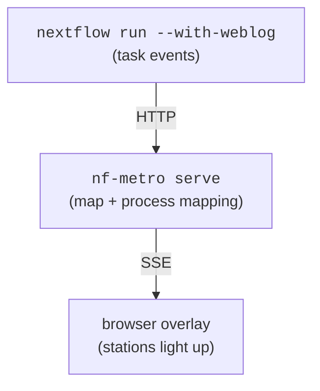

import { Steps } from "@astrojs/starlight/components";

:::note[Stable since 1.0]
The `%%metro process:` directive, `nf-metro serve` / `nf-metro check-mapping`
commands, and the event/overlay formats are stable as of 1.0 and covered by
semantic versioning.
:::

nf-metro can light up a metro map in real time as a Nextflow pipeline runs.
Stock Nextflow `-with-weblog` posts task events to `nf-metro serve`, which draws
a status overlay on top of the static map - stations go pending → queued →
running → done (or failed) with a per-sample count. No Seqera Platform, no
plugin.



The layout is computed once and the overlay is drawn on top, so the map never
re-flows as state changes.

<video
  controls
  autoplay
  loop
  muted
  playsinline
  style="width: 100%; max-width: 760px; border-radius: 6px"
  src="../assets/live_demo.mp4"
>
  Your browser can't play the embedded video -
  <a href="../assets/live_demo.mp4">download it here</a>.
</video>

_A pipeline run lighting up the map in real time._

## 1. Map stations to processes

A metro station is a curated abstraction that usually stands for several
Nextflow processes (often a whole subworkflow), so the mapping is many-to-one.
Declare it with `%%metro process:` directives - a station id and a regex
matched against the **fully-qualified** process name:

```metro
%%metro process: align | NFCORE_RNASEQ:RNASEQ:.*ALIGN.*
%%metro process: qc    | FASTQC
%%metro process: qc    | MULTIQC
```

- The whole field after `|` is one regular expression (no comma splitting, so
  quantifiers like `{1,3}` are safe). Repeat the directive to attach several
  patterns to one station.
- A bare name matches a scoped one, so `FASTQC` matches
  `NFCORE_RNASEQ:RNASEQ:FASTQC`.
- Only stations with a `process:` directive change state; everything else is
  drawn but stays neutral. Plumbing processes (versions dumps, samplesheet
  checks) are typically left unmapped on purpose.
- The mapping is **many-to-one**: a station may represent several processes,
  but a given process should light up **one** station. If a process matches the
  patterns of two stations its progress is duplicated on the map, so
  `check-mapping` reports that as a failure - keep each station's patterns
  specific enough not to overlap (lean on the scope prefix,
  `NFCORE_RNASEQ:RNASEQ:ALIGN:...`, when a tool recurs).
- The directive is pure metadata: it never affects the rendered map.

### Skip the boilerplate with `auto_process`

When a map's station ids already name their processes (`star`, `salmon_quant`,
`trimgalore`, ...), writing a `process:` line per station just restates the id.
Set `%%metro auto_process: true` (or pass `--auto-process`) and each station
with no explicit directive gets its own id as a default pattern, anchored to the
final segment of the process name:

```metro
%%metro auto_process: true
```

`star` then matches `...:STAR_ALIGN`, `salmon_quant` matches `...:SALMON_QUANT`,
and so on; a tool name buried in the scope path (e.g. `...:QUANTIFY_STAR_SALMON:SALMON_QUANT`)
does **not** light up the `star` station. You write explicit `process:` lines
only for the exceptions:

- **Abstraction stations** whose id is not a process name (`fastqc_raw`,
  `fastqc_trimmed`, `multiqc_final`) - the default matches nothing, so they stay
  dark until you map them.
- **One process under several scopes** - if the same process name runs in two
  subworkflows that the map draws as separate stations (e.g. `salmon_quant` for
  the genome aligner and `salmon_pseudo` for the pseudo-aligner), scope each
  override by its subworkflow so the right station lights up.

Run `check-mapping` after enabling it: a default that matches nothing surfaces
as a dead pattern, pointing you straight at the stations that still need a line.

### Factor out the shared prefix with `process_scope`

The explicit `process:` lines for the exceptions all repeat the pipeline's
fully-qualified prefix (`NFCORE_RNASEQ:RNASEQ:...`) and have to be written as
regexes. Set `%%metro process_scope:` (or pass `--process-scope`) to the shared
prefix and each `process:` value becomes the **tail** under that scope, joined
as `<scope>:<tail>` and matched **literally**:

```metro
%%metro process_scope: NFCORE_RNASEQ:RNASEQ
%%metro auto_process: true

%%metro process: fastqc_raw    | FASTQ_FASTQC_UMITOOLS_TRIMGALORE:FASTQC
%%metro process: salmon_quant  | QUANTIFY_STAR_SALMON:SALMON_QUANT
%%metro process: salmon_pseudo | QUANTIFY_PSEUDO_ALIGNMENT:SALMON_QUANT
```

- The prefix lives in one place, so the per-station lines carry only what
  distinguishes them.
- Values are matched **literally** under a scope - a `.` is a dot, not a
  wildcard - so a pasted process path is robust with no regex to get wrong.
- Dropping the scope (and the explicit lines) falls back to `auto_process` leaf
  matching, which ignores the path entirely and so survives a subworkflow
  renesting; keep the explicit scoped lines where you need precision instead.

Without a `process_scope`, `process:` values stay regexes (e.g.
`NFCORE_RNASEQ:RNASEQ:.*ALIGN.*`), unchanged.

## The embedded data manifest

`nf-metro serve` lights up a map because it holds the in-memory graph - it
knows each station's coordinates and the `process:` mapping. A tool that has
only the **committed SVG file** (no Python, no graph) needs that information
carried inside the file, so every rendered SVG embeds a machine-readable
manifest: a JSON block in a `<metadata id="diagram-manifest">` element plus
`data-node-*` attributes on each station's `<g>`. An overlay can then be
positioned, stations restyled, and process mappings looked up with no
re-render.

The manifest format is tool-neutral (a station is a _node_, a line a _group_, a
section a _region_); its schema, matching semantics, and reader/matcher tooling
are a standalone contract documented on the [Data manifest](/nf-metro/manifest/) page -
the same standard any non-metro tool can emit. Set `%%metro manifest: false`
(or `--no-manifest`) to emit the drawn map only, with no manifest, no
`data-node-*` attributes, and no station-group wrapper.

The manifest is only the static half of the contract. The **runtime state**
this section drives an overlay from - the `pending`/`queued`/`running`/`done`/
`failed` enum, the `done`/`total` counts, and the snapshot JSON shape `GET
/state` and `/stream` below serve - is specified normatively, with its own
JSON Schema, in [Data manifest → Drive a live
overlay](/nf-metro/manifest/#drive-a-live-overlay-the-state-snapshot).
Everything in this page below that point (the weblog receiver, `serve`, the
Nextflow plugin) is **one binding** of that vocabulary to Nextflow; a host
that already has its own authoritative task state needs only the manifest and
the state schema, not this server.

`serve` is one ready-made consumer of the manifest and one reference
producer of the state snapshot. To drive the overlay from your **own**
application instead, see the [Embedding guide](/nf-metro/embedding/).

## 2. Serve the map

`serve` hosts **one** map at a stable URL. Each run's `started` event resets it,
so it's the mode for iterating on a single pipeline - re-run and watch the same
page - and it's the server the plugin's managed mode spawns. For many pipelines
or runs side by side, use the dashboard in §2b instead.

`serve` accepts two input formats:

- **`.mmd`** - the source file; `serve` renders and lays out the map on startup.
  Use this during map development, since changing the file and restarting
  immediately reflects the update.
- **`.svg`** - a pre-rendered SVG with its embedded manifest (the default output
  of `nf-metro render`). `serve` reads station geometry and the process mapping
  directly from the manifest - no re-render, no Python graph. Use this when you
  have committed the SVG to a repo and want to serve it without the source, or
  when you want layout to be stable across restarts regardless of any tool
  version change. The `--theme` option has no effect in this mode (the SVG is
  already drawn).

:::tip[SVG must carry a manifest]
The SVG path requires the manifest embedded in the file. `nf-metro render`
embeds it by default. If you opted out with `--no-manifest`, re-render
without that flag before serving.
:::

### One-liner (recommended)

Pass the Nextflow command after `--` and `serve` handles everything: it wires
`-with-weblog` automatically, opens your browser, and shuts itself down when the
run finishes.

```bash
# from a source file
nf-metro serve path/to/map.mmd --open --shutdown-after-complete -- \
    nextflow run my/pipeline

# from a pre-rendered SVG
nf-metro serve path/to/map.svg --open --shutdown-after-complete -- \
    nextflow run my/pipeline
```

### Two-shell alternative

If you prefer to keep the server and the pipeline in separate terminals (useful
when iterating across many re-runs with the server left running):

```bash
# shell 1 - the live server (either input format works)
nf-metro serve path/to/map.mmd --port 8080
# open http://localhost:8080/

# shell 2 - the pipeline
nextflow run my/pipeline -with-weblog http://localhost:8080/events
```

Stations light up as tasks are submitted, run, and complete. A browser that
connects mid-run receives the current state immediately, so you never see a
blank map.

| Option                      | Meaning                                                                                                                              |
| --------------------------- | ------------------------------------------------------------------------------------------------------------------------------------ |
| `--port`                    | Port to listen on (default 8080).                                                                                                    |
| `--host`                    | Interface to bind. Default `127.0.0.1` (local only); use `0.0.0.0` to accept connections from other hosts.                           |
| `--theme`                   | Theme name (`nfcore`, `light`, `seqera`). The page chrome (background, text) follows the theme, so a light theme gives a light page. |
| `--overlay`                 | Status-overlay style: `ring` (default), `pulse`, `dot`, or `led`. Sets the style shown until a viewer picks another.                 |
| `--open`                    | Open the live page in the default browser when the server starts.                                                                    |
| `--shutdown-after-complete` | Stop the server shortly after the run's `completed` or `error` event (or after the launched command exits).                          |
| `--shutdown-grace`          | Seconds to keep the map up after the run finishes before shutting down (used with `--shutdown-after-complete`; default 5).           |
| `--token`                   | If set, `/events` POSTs must supply `?token=...` or an `X-Metro-Token` header.                                                       |

### Overlay styles

The status overlay - how a station shows pending / queued / running / done /
failed - has a few looks, picked in the page's **Style** menu (the choice is
remembered per browser) or set as the page default with `--overlay`. Every mark
takes the station's own marker shape: a circle for a single-line stop, a capsule
spanning the bundle for an interchange.

- **`ring`** (default) - a bold outline hugging each station, leaving the marker
  visible underneath; the dash marches around it while running. Clean and
  professional; the recommended look for a light page or embedding in Seqera
  Platform.
- **`pulse`** - a crisp status mark filling the station with a radar ripple
  while running.
- **`dot`** - a flat status mark that gently breathes while running, no glow.
  The most minimal option.
- **`led`** - glowing neon marks that pulse while running; reads best on the
  dark `nfcore` theme.

All styles are driven entirely client-side from the same status data, so
switching style never re-renders the map. Animations respect
`prefers-reduced-motion`.

### Endpoints

| Path           | Purpose                                                                                    |
| -------------- | ------------------------------------------------------------------------------------------ |
| `GET /`        | The live page (static SVG + status overlay).                                               |
| `GET /stream`  | Server-sent events; the page subscribes to this. Each event's `data:` is a state snapshot. |
| `GET /state`   | Current state snapshot as JSON (handy for scripting/debugging).                            |
| `POST /events` | Nextflow weblog receiver.                                                                  |

`/state` and each `/stream` message share one JSON shape - the [state
snapshot](/nf-metro/manifest/#drive-a-live-overlay-the-state-snapshot), validatable
via `nf_metro.live.state_schema()`.

## 2b. Persistent server (many runs)

Where `serve` is one map reused across re-runs (reset each time), `serve-multi`
is a long-lived **dashboard**: each registered run is its own `/r/<id>/` entry,
so many pipelines - or a history of runs - sit side by side. It starts with
**no** map; a pipeline registers its map by POSTing the `.mmd` to `/maps`, then
sends weblog events to the run's own endpoint:

```bash
nf-metro serve-multi --port 8080        # index at http://localhost:8080/

# a pipeline registers its map (returns {"id","view","events"})
curl -s --data-binary @map.mmd "http://localhost:8080/maps?name=myrun"
# then POST weblog events to the returned /r/<id>/events
```

`GET /` lists every run with a live status; `GET /r/<id>/` is that run's live
map. Endpoints mirror the single-map server under a `/r/<id>/` prefix
(`/r/<id>/`, `/r/<id>/state`, `/r/<id>/stream`, `POST /r/<id>/events`);
`POST /maps` registers a run.

### Demo: a shared dashboard

<Steps>

1. Start the dashboard server:

   ```bash
   nf-metro serve-multi --port 8080            # dashboard at http://localhost:8080/
   ```

2. Register each pipeline's map and capture the run id:

   ```bash
   # register the map (prints JSON with "id" and "events" fields)
   RUN=$(curl -s --data-binary @assets/metro_map.mmd \
         "http://localhost:8080/maps?name=myrun")
   RUN_ID=$(echo "$RUN" | python3 -c "import sys,json; print(json.load(sys.stdin)['id'])")
   ```

3. Start Nextflow pointing at that run's events endpoint:

   ```bash
   nextflow run my/pipeline \
     -with-weblog "http://localhost:8080/r/${RUN_ID}/events"
   ```

</Steps>

Repeat for as many pipelines as you like. Open `http://localhost:8080/` to
watch every run light up on one page; the server stays up across runs.

## 2c. The Nextflow plugin (optional)

Everything in §2 and §2b works with **no plugin**: Nextflow's built-in
`-with-weblog` posts events to a running server, and the persistent dashboard
is driven by a `curl` to `/maps` plus a per-run `-with-weblog` URL. The
[nf-metro Nextflow plugin](https://github.com/seqeralabs/nf-metro-plugin) is a
convenience layer on top - it emits the same events, but from config and with
the plumbing handled for you. The Python tooling here never depends on it.

### Installing the plugin

:::caution[Not yet on the Nextflow plugin registry]
The plugin is not yet published to the Nextflow plugin registry, so the
normal `plugins { id 'nf-metro@0.1.0' }` auto-download does not work yet.
Build and install it locally first:

```bash
git clone https://github.com/seqeralabs/nf-metro-plugin
cd nf-metro-plugin
make install        # installs to ~/.nextflow/plugins
```

Requires Java 17+ and Nextflow 25.10.0+. Once installed, the `plugins {}`
block in the config examples below will find it.

Alternatively, run against the build tree without installing (build first,
then set `NXF_PLUGINS_DEV`; still requires `-plugins` on the command line):

```bash
git clone https://github.com/seqeralabs/nf-metro-plugin
cd nf-metro-plugin
make assemble       # build but do not install
# then, from anywhere:
NXF_PLUGINS_DEV=/path/to/nf-metro-plugin \
  nextflow run my/pipeline -plugins nf-metro@0.1.0
```

:::

### Plugin demo: shared dashboard

The plugin's `metro.server` mode does the register-and-emit automatically, so a
plain `nextflow run` shows up on the dashboard:

Start one persistent server:

```bash
nf-metro serve-multi --port 8080            # dashboard at http://localhost:8080/
```

Point any pipeline at it via the plugin's `metro` config (in `nextflow.config`
or a `-c` overlay), then run it normally:

```groovy
plugins { id 'nf-metro@0.1.0' }
metro {
    server = 'http://localhost:8080'
    map    = 'assets/metro_map.mmd'
}
```

```bash
nextflow run my/pipeline      # repeat for as many pipelines as you like
```

Each run prints `registered on ...; live map: http://localhost:8080/r/<id>/`.
Open `http://localhost:8080/` to watch every run light up on one page; the
server stays up across runs.

| Task             | Without the plugin                                                                        | With the plugin                                                                 |
| ---------------- | ----------------------------------------------------------------------------------------- | ------------------------------------------------------------------------------- |
| Wiring           | `-with-weblog <url>` on every run                                                         | One `plugins { id 'nf-metro' }` + a `metro {}` block in `nextflow.config`       |
| Run the server   | Start `nf-metro serve` yourself in another shell                                          | **Managed mode** spawns and stops it for the run (and can open the browser)     |
| Shared dashboard | `curl` the map to `/maps`, read the run id, then point `-with-weblog` at `/r/<id>/events` | **Central mode** registers the map and wires the per-run endpoint automatically |
| Find the map     | -                                                                                         | Prints the live URL in the run log                                              |

So the standalone path is fine for a quick look; the plugin is worth it when you
want the integration to live in the pipeline's config, want the server started
and stopped for you, or want runs to self-register on a shared dashboard (the
register-then-emit step is awkward to do by hand). The plugin has three modes -
attach, managed, central - documented in its
[README](https://github.com/seqeralabs/nf-metro-plugin#three-modes).

:::note[Managed mode requires `nf-metro` on PATH]
Managed mode spawns `nf-metro serve` as a subprocess, so the `nf-metro`
command must be on the PATH when Nextflow runs. If it is not found the
plugin logs a warning and the pipeline continues without the live map.
Use `metro.binary = '/absolute/path/to/nf-metro'` in the config to point
to a specific installation.
:::

## 3. Keep the mapping honest

The risk with any mapping is drift: a new process the map can't show (silently
invisible), a station pattern that matches nothing (stale), or a process whose
patterns match more than one station (duplicated progress). `check-mapping`
makes all three loud so CI can gate on them:

```bash
# Export the pipeline's process graph, then lint the map against it
nextflow run my/pipeline -with-dag dag.mmd -preview
nf-metro check-mapping path/to/map.mmd --dag dag.mmd
```

```text
Processes with no station (invisible): 1
  - BWA_MEM
Station patterns matching no process (stale): 1
  - align: NFCORE_RNASEQ:RNASEQ:OLD_ALIGNER
Processes matching more than one station (duplicates progress): 1
  - FASTQC: align, qc
```

It exits non-zero when it finds drift. Options:

| Option               | Meaning                                                                                                         |
| -------------------- | --------------------------------------------------------------------------------------------------------------- |
| `--dag <file>`       | A `nextflow -with-dag` Mermaid export; process names are read from its stadium nodes.                           |
| `--processes <file>` | A newline-delimited list of process names (e.g. captured from a run) - an authoritative alternative to `--dag`. |
| `--ignore <regex>`   | Processes deliberately left unmapped (plumbing such as `.*:DUMPSOFTWAREVERSIONS`). Repeatable.                  |

Stations with no mapping at all are reported as a note (they never light up),
but are not treated as failures since they may be intentional.

## Deployment notes

- **Reachability.** For HPC/cloud runs the weblog POSTs come from wherever
  Nextflow executes, not your laptop. Run the server somewhere reachable from
  there (the head node), or tunnel: `ssh -L 8080:localhost:8080 headnode` and
  point the run at `http://localhost:8080/events`.
- **Security.** `/events` is unauthenticated by default and the server binds
  `127.0.0.1`. When binding a non-local interface (`--host 0.0.0.0`), set
  `--token` so only your run can post events. The token can be sent as the
  `X-Metro-Token` header or a `?token=` query param; prefer the header where you
  can, since a URL with the token lands in shell history and process listings.
- **Run lifecycle.** A `started` event resets the map, so re-running a pipeline
  re-animates a fresh map. The server tracks one run at a time. Unrecognised or
  malformed event payloads are accepted and ignored (the endpoint always returns 200) so a Nextflow version emitting extra event types can't stall a run.
- **No denominator.** Nextflow's task count is dynamic, so the per-station
  count is "done / submitted so far", not a fixed percentage.

## Try it

The repository ships a self-contained demo under
[`examples/live/`](https://github.com/seqeralabs/nf-metro/tree/main/examples/live):
a toy workflow whose processes only `sleep`, a mapped map, and a process list
for `check-mapping`. From the repo root:

```bash
nf-metro serve examples/live/pipeline.mmd --open --shutdown-after-complete -- \
    nextflow run examples/live/workflow/main.nf \
              -c examples/live/workflow/nextflow.config
```

Three coloured lines fan out after Trim Galore, run in parallel, then converge
at MultiQC. The browser opens automatically and the server stops when the
pipeline finishes.
