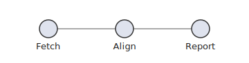
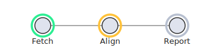
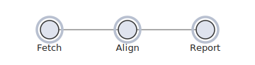
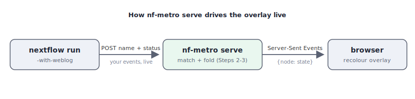

# The data manifest

!!! note "Stable since 1.0"
    The manifest schema, `diagram-manifest` element id, and `data-node-*`
    attribute names are stable as of nf-metro 1.0 and covered by semantic
    versioning. Incompatible schema changes will bump the `version` field and
    the nf-metro major version together.

Every SVG nf-metro renders is a **self-describing, addressable artifact**: a
downstream tool can drive it - position overlays, restyle nodes, look up which
processes a node represents - from the **committed file alone**, without
re-running whatever drew it.

That contract is not specific to metro maps. This page documents the format as a
standalone standard and the tooling nf-metro ships to produce and consume it, so
**any** diagram tool can emit a conforming SVG. nf-metro is just the first
producer.

!!! tip "Just want to make one? Start with the tutorial"
    If your goal is simply to produce an SVG and drive it from events, skip the
    spec and jump to the [tutorial](#tutorial-light-up-a-diagram-as-a-job-runs):
    it builds one end to end and finishes with a single script you can copy and
    run. The sections in between are the format reference, aimed at implementers.

!!! note "Headed for its own package"
    The tooling lives in `nf_metro.manifest`, a dependency-free module (Python
    standard library only, no other nf-metro imports). It is structured so it can
    later be lifted into its own distribution as-is; until then, import it from
    nf-metro.

## Terminology

The format is **tool-neutral**, so its vocabulary is generic rather than
metro-flavoured:

| Term | Meaning |
|------|---------|
| **manifest** | The JSON description of the diagram, embedded in the SVG. |
| **node** | An addressable point on the diagram - the thing a consumer locates, restyles, or lights up. Has an `id`, a centre (`x`/`y`), a radius (`r`), and an optional label. |
| **group** | An optional **multi-membership** category a node can belong to several of, each with a display `color` (e.g. a colour-coded series). |
| **region** | An optional **single-membership** container a node sits inside (e.g. a labelled box). |
| **pattern** | A regex on a node that identifies it against a runtime string. A node carries zero or more. |
| **target** | What the patterns are matched against, named in the manifest's `match` block (for a Nextflow run, the fully-qualified process name). |

A producer with no grouping concept uses `nodes` alone and leaves `groups` and
`regions` empty.

### How nf-metro maps onto it

nf-metro draws metro maps, so its own code, `.mmd` files, and live server speak
metro: **stations, lines, sections, processes**. The renderer's adapter
translates those into the neutral wire vocabulary, so the SVG you get is in the
generic terms above:

| nf-metro (metro) | Manifest (neutral) |
|------------------|--------------------|
| station          | node               |
| line             | group              |
| section          | region             |
| `%%metro process:` patterns | node `patterns` |

So if you author a metro map but read the rendered SVG, you'll find `nodes`, not
`stations` - that is expected, and it's what makes the file portable.

## What's in the file

The data is carried two redundant, sanitization-safe ways - **no `<script>`**, so
it survives the inline-SVG sanitizers a host web app typically runs:

1. A JSON manifest in a `<metadata id="diagram-manifest">` element.
2. `data-node-*` attributes on each node's wrapping `<g>`.

A node's `id` is the **join key**: it equals `data-node-id="<id>"` on the
element, so a consumer can go manifest→element and element→manifest without
guessing.

### Manifest schema

```json
{
  "version": "1.0",
  "match": { "target": "fqProcessName", "type": "regex", "flags": "i" },
  "title": "nf-core/rnaseq",
  "width": 1829,
  "height": 724,
  "groups":  [ { "id": "star_salmon", "label": "STAR + Salmon", "color": "#e64949" } ],
  "regions": [ { "id": "preprocessing", "label": "Pre-processing" } ],
  "nodes": [
    {
      "id": "fastqc",
      "label": "FastQC",
      "x": 120.0, "y": 80.0, "r": 5.0,
      "groups": ["star_salmon", "star_rsem"],
      "region": "preprocessing",
      "patterns": ["FASTQC", "MULTIQC"]
    }
  ]
}
```

- **`nodes` are the addressable points** - every node in the diagram. Unmapped
  ones carry an empty `patterns` list, so the manifest is a complete inventory,
  not only the subset that lights up.
- **`id` join key** - equals `data-node-id="<id>"` on the element.
- **Coordinate space** - `x`/`y`/`r` are absolute SVG user units inside
  `viewBox="0 0 width height"` (the producer must emit no outer transform), so an
  overlay sharing that viewBox lines up exactly. `r` is a single nominal marker
  radius. Coordinates are rounded to one decimal place.
- **`groups` / `regions`** are optional metadata; a node references them by id
  (`node.groups`, `node.region`).
- **Forward compatibility** - consumers MUST ignore unknown fields; additive
  fields keep the same major `version`.

A machine-readable **JSON Schema** (draft 2020-12) ships with the package
(`nf_metro/manifest/schema.json`); `manifest_schema()` returns it as a dict. Its
required fields are exactly the [minimum-conforming](#minimum-to-be-conforming)
set.

To validate an SVG, read its manifest out and check it against the schema. In
Python (`pip install jsonschema` - it is not an nf-metro runtime dependency):

```python
import jsonschema
from nf_metro.manifest import read_manifest, manifest_schema

manifest = read_manifest(open("pipeline.svg").read())
if manifest is None:
    raise SystemExit("no diagram manifest embedded in this SVG")
jsonschema.validate(manifest, manifest_schema())   # raises ValidationError if it doesn't conform
```

Or from the command line, without writing any code:

```bash
nf-metro validate-svg pipeline.svg
# Valid: 42 nodes, schema version 1.0   (exits non-zero if it doesn't conform)
```

(`validate-svg` uses `jsonschema`; install it with `pip install jsonschema` if it
isn't already present.)

Add `--geometry` to also check the *drawn* picture, not just the schema: it flags
a route drawn through a station's label or marker (rail interchanges excepted).
The offset-collapse check (distinct lines merging into one stroke) needs the
engine's assigned offsets, so it runs only via [`render --validate`](index.md#validating-the-rendered-geometry).

```bash
nf-metro validate-svg pipeline.svg --geometry
```

In another language, extract the `<metadata id="diagram-manifest">` JSON the same
way and feed it, with the shipped `schema.json`, to any standard JSON Schema
validator.

### Per-node attributes

```html
<g data-node-id="fastqc"
   data-node-cx="120.0" data-node-cy="80.0" data-node-r="5.0"
   data-node-groups="star_salmon,star_rsem"
   data-node-region="preprocessing">
  ...the node's drawn glyph...
</g>
```

The geometry attributes mirror the manifest's `x`/`y`/`r`, so a consumer can
position against either half interchangeably. `data-node-region` is omitted when
the node belongs to no region. (A producer may add its own attributes or classes
alongside these - nf-metro tags the group `nf-metro-station-group`, for example -
but only the `data-node-*` set is part of the contract.)

### Matching semantics

`patterns` are regular expressions matched **case-insensitively** against a
runtime target string. The `match` block names the target so a non-Python (and
non-Nextflow) consumer can reproduce the rule: for a Nextflow run the target is
the **fully-qualified process name** (`NFCORE_RNASEQ:RNASEQ:FASTQC`); another
producer sets `target` to whatever identifier its runtime emits.

Keep patterns within a portable regex subset common to Python `re` and
JavaScript `RegExp` - character classes, anchors, `.`/`*`/`+`/`?`, bounded
`{m,n}`, alternation, groups - so two implementations cannot diverge. Avoid
Python-only constructs (named groups `(?P<>)`, inline flags `(?i)`, possessive
quantifiers, `\Z`).

A target may legitimately match **more than one** node; how to resolve that is a
consumer-side policy decision, not a schema error.

## Minimum to be conforming

The shortest path to a file a consumer can drive:

**Required** - an overlay positions itself from these alone:

- An SVG root with `viewBox="0 0 width height"` and no outer transform.
- Exactly one `<metadata id="diagram-manifest">` holding the JSON, with at least
  `version`, `width`, `height`, and `nodes` - each node carrying an `id` and
  `x`/`y`/`r`.

**Required only for matching** (e.g. lighting up nodes from a running job):

- The `match` block (`target`/`type`/`flags`) and a `patterns` list on each node
  that represents something.

**Recommended** - lets a consumer find and restyle the *drawn* node in place
(rather than only overlaying on top):

- Wrap each node's glyph in a `<g>` with `data-node-id="<id>"` (matching the
  manifest `id`) and `data-node-cx`/`-cy`/`-r`.

Everything else (`label`, `groups`, `regions`, the live state model below) is
optional.

## The functions

The whole toolkit is a handful of small functions, all importable from
`nf_metro.manifest` (and re-exported from `nf_metro.render`). Grouped by job:

| Function | What it does |
|----------|--------------|
| `build_manifest_data(*, title, width, height, nodes, groups=(), regions=(), match_target="fqProcessName")` | Assemble the manifest dict from plain node data. Rounds coordinates; fills the `match` block. |
| `node_data_attrs(*, id, x, y, r, groups=(), region=None)` | Return the `data-node-*` attributes for one node's element, as a dict to spread onto your `<g>`. |
| `manifest_metadata_svg(manifest)` | Return just the `<metadata>` element (as a string) - use it when you assemble the SVG yourself. |
| `inject_manifest(svg, manifest)` | Insert that `<metadata>` into an existing SVG string, right after the opening `<svg>` tag. Returns the new SVG. |
| `read_manifest(svg)` | Parse the embedded manifest back out of an SVG string; returns the dict, or `None` if there's no manifest. |
| `match_node_ids(manifest, target)` | Node ids whose `patterns` match `target` (case-insensitive) - "which node does this runtime name light up?". |
| `matching_node_ids(target, patterns_by_id)` | The same matcher over a plain `{id: [pattern]}` map, when your data isn't a full manifest. |
| `overlay_svg(manifest, body="", *, extra_attrs="")` | A transparent overlay `<svg>` sized to the manifest's `viewBox`, to stack over the base so coordinates line up. |
| `manifest_json(manifest)` | Deterministic JSON serialization of a manifest (sorted keys); rarely needed directly. |
| `manifest_schema()` | Return the JSON Schema (draft 2020-12) for a manifest, to validate a producer's output in any language. |

Producing a file uses the first four; consuming one uses `read_manifest` +
`match_node_ids`; a live overlay adds `overlay_svg`. The two constants
`MANIFEST_SCHEMA_VERSION` and `MANIFEST_ELEMENT_ID` (`"diagram-manifest"`) are
exported too. The rest of this page shows them in context.

## Produce a conforming SVG

### In Python (any diagram, not just metro maps)

`nf_metro.manifest` builds a manifest from plain node data and embeds it into an
SVG you drew by any means - it never needs a `MetroGraph`:

```python
from nf_metro.manifest import (
    build_manifest_data, node_data_attrs, inject_manifest,
)

manifest = build_manifest_data(
    title="My Tool",
    width=100, height=100,
    nodes=[
        {"id": "trim", "x": 50, "y": 50, "r": 4, "patterns": ["TRIM.*"]},
    ],
)

# Decorate the node's element with the addressable mirror...
attrs = node_data_attrs(id="trim", x=50, y=50, r=4)
attr_str = " ".join(f'{k}="{v}"' for k, v in attrs.items())
svg = f'<svg viewBox="0 0 100 100"><g {attr_str}><circle cx="50" cy="50" r="4"/></g></svg>'

# ...and splice the manifest in after the opening <svg> tag.
svg = inject_manifest(svg, manifest)
```

Each `nodes` entry takes required `id`, `x`, `y`, `r` and optional `label`
(defaults to `id`), `groups`, `region`, and `patterns`. Coordinates are rounded
for you. `groups` and `regions` are optional grouping metadata.

A node is addressed as a **centre point plus a nominal radius** (overlay-shaped,
not the full glyph outline). If your nodes are boxes, pass the box centre as
`x`/`y` and a representative radius for `r` - an overlay only needs somewhere to
anchor, not your exact geometry.

If your runtime doesn't emit Nextflow process names, set `match_target` to the
identifier it does emit, so the file honestly describes what its `patterns`
match:

```python
build_manifest_data(..., match_target="stepName")
# -> "match": { "target": "stepName", "type": "regex", "flags": "i" }
```

### In any language

You don't need this library to produce a conforming file - emit the bytes
directly:

1. Draw your SVG with `viewBox="0 0 width height"` and no outer transform.
2. Insert a `<metadata id="diagram-manifest">` element holding the JSON above as
   CDATA. (CDATA cannot contain `]]>`; if a regex does, split it as
   `]]]]><![CDATA[>`.)
3. *(Recommended)* For each node, wrap its glyph in a `<g>` carrying
   `data-node-id` (a stable id) and `data-node-cx`/`-cy`/`-r` (its centre and
   radius, 1dp). Keep this geometry in agreement with the manifest - `id` is the
   join key between them.

## Read and match

`nf_metro.render` re-exports the canonical reader and matcher (also available
from `nf_metro.manifest`):

```python
from nf_metro.render import read_manifest, match_node_ids

manifest = read_manifest(open("pipeline.svg").read())
match_node_ids(manifest, "NFCORE_RNASEQ:RNASEQ:FASTQC")   # -> ["fastqc"]
```

`read_manifest` is a plain regex extract (no XML library needed); a consumer in
another language reproduces the matcher by walking `nodes[].patterns` and testing
each regex case-insensitively against the target, collecting the `id`s that hit.

`match_node_ids` takes a whole manifest (keyed on the schema's `nodes`).
`matching_node_ids` is the same matcher over a plain `id -> [pattern]` mapping,
for a producer whose data isn't manifest-shaped.

## Drive a live overlay

Everything above defines the compatibility contract; the state model below is
optional convention. A consumer that only needs static addressing can stop here.

!!! tip "Worked example"
    The [tutorial](#tutorial-light-up-a-diagram-as-a-job-runs) at the end of this
    page builds a tiny pipeline diagram and lights it up from a progress snapshot,
    end to end, in ~40 lines.

The manifest gives an overlay everything it needs without a re-render: the
`viewBox` to share, and each node's `id`, centre, and radius. **The standard
fixes the geometry and the addressing, not the visual style** - how you draw
"running" vs "done" is yours.

A common shape for progress is a small per-node state model:

| Field | Meaning |
|-------|---------|
| `state` | One of `pending`, `queued`, `running`, `done`, `failed`. |
| `done` / `total` | Tasks finished vs seen so far for that node. Nextflow's task count is dynamic, so this is "done / submitted so far", not a fixed percentage. |

plus a run-level `{ name, state }` where `state` is `idle` / `running` /
`complete` / `error`.

nf-metro's `serve` is **one reference implementation** of this: it draws a glowing
LED halo per node and recolours it by state (see [Live progress](live.md)). A
host application is free to map the same state vocabulary onto its own visual
language - filled badges, a progress bar, a colour change on the node itself.
Take the geometry and the state model from the standard; bring your own paint.

To turn a specific runtime's events into that state model, write a binding.
nf-metro ships one for Nextflow's `-with-weblog` stream; that path, the server,
and the Nextflow plugin are documented under [Live progress](live.md).

## Tutorial: light up a diagram as a job runs

A complete, self-contained example for a tool that is **not** nf-metro. By the
end you'll have a small pipeline diagram that shows progress as work happens -
and you can run every snippet here as-is, with **no pipeline, no server, and no
Nextflow** (we'll fake the progress). About 50 lines, only `nf_metro.manifest`.

**The idea.** Draw the diagram *once* and embed a manifest in it. Then, whenever
progress changes, draw a thin **overlay** of status markers on top. The diagram
itself never re-flows; only the lightweight overlay updates. The mental model:
the base SVG is the **map** - drawn once and durable - and the overlay is a
cheap, **disposable status layer** you redraw as things change. We'll model a
three-step pipeline - **Fetch → Align → Report**.

**What's doing the work.** The only library is `nf_metro.manifest` - the
standard-library-only module described above. No `MetroGraph`, no nf-metro
renderer, no drawing or templating library: we assemble the SVG as plain Python
strings and use `nf_metro.manifest` for the four manifest-specific jobs - build
it (`build_manifest_data`), embed it (`node_data_attrs`, `inject_manifest`), read
it back (`read_manifest`), and match runtime names to nodes (`match_node_ids`).

### Step 1 - draw the diagram and embed a manifest

We hand-draw three circles (one per step), wrap each in a `<g>` carrying its
`data-node-*` attributes, and splice in the manifest. Don't worry about absorbing
every field; the only new ideas here are that each node needs coordinates, and
that the manifest gets embedded into an otherwise ordinary SVG.

- **For now**, the fields that matter are `id` and `x`/`y`/`r` - the node's name,
  and where it sits and how big it is (an overlay anchors here).
- **Later**: `patterns` (the names this node answers to) and `match_target` are
  for Step 2's matching; you can ignore them until then. We'll match against step
  names, so `match_target="stepName"`.

```python
from nf_metro.manifest import (
    build_manifest_data, node_data_attrs, inject_manifest,
    read_manifest, match_node_ids,
)

NODES = [
    {"id": "fetch",  "label": "Fetch",  "x": 70,  "y": 42, "r": 13, "patterns": ["FETCH"]},
    {"id": "align",  "label": "Align",  "x": 180, "y": 42, "r": 13, "patterns": ["BWA.*", "STAR.*"]},
    {"id": "report", "label": "Report", "x": 290, "y": 42, "r": 13, "patterns": ["MULTIQC"]},
]
W, H = 360, 92

def node_svg(n):
    attrs = " ".join(
        f'{k}="{v}"'
        for k, v in node_data_attrs(id=n["id"], x=n["x"], y=n["y"], r=n["r"]).items()
    )
    return (
        f'<g {attrs}>'
        f'<circle cx="{n["x"]}" cy="{n["y"]}" r="{n["r"]}" fill="#dfe3ee" stroke="#333"/>'
        f'<text x="{n["x"]}" y="{n["y"] + 30}" text-anchor="middle" font-size="13">{n["label"]}</text>'
        f'</g>'
    )

edges = (
    '<line x1="83" y1="42" x2="167" y2="42" stroke="#aaa"/>'
    '<line x1="193" y1="42" x2="277" y2="42" stroke="#aaa"/>'
)
base = (
    f'<svg xmlns="http://www.w3.org/2000/svg" viewBox="0 0 {W} {H}" width="{W}" height="{H}">'
    f'{edges}{"".join(node_svg(n) for n in NODES)}</svg>'
)
svg = inject_manifest(
    base,
    build_manifest_data(
        title="Toy pipeline", width=W, height=H, nodes=NODES, match_target="stepName"
    ),
)
```

Three functions did the work: `node_data_attrs` produced each node's
`data-node-*` attributes, `build_manifest_data` assembled the manifest from the
node list, and `inject_manifest` placed that manifest inside the SVG. `svg` is now
a self-describing file - three labelled nodes plus a `<metadata
id="diagram-manifest">` block and `data-node-*` attributes. Save it to a `.svg` if
you like; everything below works from that file alone.



### Step 2 - connect the diagram to the work

Something has to actually *run* your pipeline's steps - a workflow engine, a CI
job, a plain script. Call it the **runtime**. As it works, it announces each step
by a **name**: it might log that a step called `BWA_MEM` has started, then that it
finished, and so on.

Two snags: you usually don't choose those names (a tool may call your "Align" step
`BWA_MEM` or `STAR_ALIGN`), and they rarely equal your node ids. That's exactly
what each node's `patterns` are for - regexes that match the names *your* runtime
uses. `match_node_ids` answers the question "which node does this name belong
to?":

```python
manifest = read_manifest(svg)

match_node_ids(manifest, "BWA_MEM")   # -> ['align']
match_node_ids(manifest, "multiqc")   # -> ['report']  (matching is case-insensitive)
```

Nothing is running yet - this just queries the file. Matching is the bridge from
"a name the runtime mentioned" to "a node on the diagram".

### Step 3 - show progress

Give each node a **state** - one of `pending`, `queued`, `running`, `done`,
`failed` - and draw a coloured ring per node at its manifest position. The colours
are your choice; the standard only tells you *where* each node is:

```python
COLORS = {
    "pending": "#b8c0d0", "queued": "#ffb020",
    "running": "#ffc23a", "done": "#2bee92", "failed": "#ff4d4d",
}

def progress_halos(manifest, states):
    """One status ring per node, positioned from the manifest geometry."""
    return "".join(
        f'<circle cx="{n["x"]}" cy="{n["y"]}" r="{n["r"] + 5}" fill="none" '
        f'stroke="{COLORS[states.get(n["id"], "pending")]}" stroke-width="3.5"/>'
        for n in manifest["nodes"]
    )
```

We have no real runtime in a tutorial, so let's **simulate** one. Here is a list
of `(step_name, new_state)` announcements - the kind of thing a real engine sends
as a run progresses. We fold each into a `{node_id: state}` map (using Step 2's
matcher) and redraw the overlay; that sequence of redraws *is* the animation:

```python
# A real runtime would send these live; we hard-code them so the tutorial runs
# on its own.
events = [
    ("FETCH",   "running"), ("FETCH",   "done"),
    ("BWA_MEM", "running"), ("BWA_MEM", "done"),   # the Align step, by its tool name
    ("MULTIQC", "running"), ("MULTIQC", "done"),   # the Report step
]

states = {}
for name, new_state in events:
    for node_id in match_node_ids(manifest, name):
        states[node_id] = new_state
    frame = svg.replace("</svg>", progress_halos(manifest, states) + "</svg>")
    # draw `frame`: write it to a file, or update the page in a browser
```

A single frame - say just after Fetch finished and Align started, when `states`
is `{"fetch": "done", "align": "running"}` - looks like this (green = done,
amber = running, grey = still pending):



Replaying the whole `events` list redraws the overlay step by step, which
animates the run from start to finish:



The rings are deliberately plain - swap in pulses, fills, per-node counts, or your
own palette without touching the contract.

### Step 4 - plug in a real runtime

Up to now everything ran in one Python script; in a real system the same logic is
split between an **event source** (whatever runs your pipeline) and a **UI**
(usually a browser). The good news is that only one thing in this tutorial was
fake: the hard-coded `events` list. Replace it with announcements from a real run
and nothing else changes - you still `match_node_ids` each name to a node
(Step 2) and fold it into the `states` map that `progress_halos` draws (Step 3).

**What Nextflow does, in the tutorial's terms.** Run a pipeline with
`nextflow run ... -with-weblog http://localhost:8080/events` and Nextflow becomes
the source of that `events` list: every time a task is submitted, starts, or
finishes it POSTs a small JSON message to that URL carrying the process name and
its status - i.e. it sends you `("BWA_MEM", "running")`, then `("BWA_MEM", "done")`,
live, instead of you writing them out.

**What `nf-metro serve` is.** It's this exact tutorial running as a small web
server, so you don't write any of the Python yourself:

1. it renders the diagram's SVG once and builds an overlay of one ring per node,
   positioned from each node's coordinates - the same idea as `progress_halos`;
2. it listens on `http://localhost:8080/`; `/events` is the URL Nextflow POSTs to;
3. on each message it runs **Step 2** (`match_node_ids` on the process name) and
   **Step 3** (fold the result into a per-node `states` map);
4. it pushes the updated `states` to the open browser page over
   [Server-Sent Events](https://developer.mozilla.org/en-US/docs/Web/API/Server-sent_events),
   and the page recolours the matching overlay ring.



So `nf-metro serve` is the tutorial wired to a live event source and a browser.
See [Live progress](live.md) to actually run it (it also has a multi-run
dashboard and an optional Nextflow plugin), and note the glowing-LED styling
there is just its choice - yours can differ.

**Doing it yourself in a browser** is the same three steps client-side:
`read_manifest` on the committed SVG, `match_node_ids` per incoming event, and
restyle the matched node. Keep the overlay as a separate
layer over the base so you never redraw the diagram - `overlay_svg` builds one
sized to match, so coordinates line up:

```python
from nf_metro.manifest import overlay_svg

# a transparent layer the same size/viewBox as the base, holding the rings:
layer = overlay_svg(manifest, progress_halos(manifest, states),
                    extra_attrs='style="pointer-events:none"')
# stack `layer` directly over the base SVG; on each event, update its rings.
```

### The complete script

Everything above as one file. It needs only nf-metro installed
(`pip install nf-metro`); it writes the diagram and one frame per event, with no
pipeline or server. Save it as `demo.py`, run `python demo.py`, then open
`toy_pipeline.svg` and the `progress_*.svg` frames in order. If it worked, you'll
have one static diagram plus six frames that turn Fetch, then Align, then Report
from grey through amber to green - and the terminal prints each event as it maps
to a node.

```python
"""Make a conforming SVG and drive it from a stream of (step, state) events.

Uses only nf_metro.manifest (Python standard library only) - no pipeline, no
server. Run `python demo.py`, then open toy_pipeline.svg and progress_*.svg.
"""

from nf_metro.manifest import (
    build_manifest_data, node_data_attrs, inject_manifest,
    read_manifest, match_node_ids,
)

# --- the diagram: one node per pipeline step --------------------------------
NODES = [
    {"id": "fetch",  "label": "Fetch",  "x": 70,  "y": 42, "r": 13, "patterns": ["FETCH"]},
    {"id": "align",  "label": "Align",  "x": 180, "y": 42, "r": 13, "patterns": ["BWA.*", "STAR.*"]},
    {"id": "report", "label": "Report", "x": 290, "y": 42, "r": 13, "patterns": ["MULTIQC"]},
]
W, H = 360, 92

def node_svg(n):
    attrs = " ".join(
        f'{k}="{v}"'
        for k, v in node_data_attrs(id=n["id"], x=n["x"], y=n["y"], r=n["r"]).items()
    )
    return (
        f'<g {attrs}>'
        f'<circle cx="{n["x"]}" cy="{n["y"]}" r="{n["r"]}" fill="#dfe3ee" stroke="#333"/>'
        f'<text x="{n["x"]}" y="{n["y"] + 30}" text-anchor="middle" font-size="13">{n["label"]}</text>'
        f'</g>'
    )

edges = (
    '<line x1="83" y1="42" x2="167" y2="42" stroke="#aaa"/>'
    '<line x1="193" y1="42" x2="277" y2="42" stroke="#aaa"/>'
)
base = (
    f'<svg xmlns="http://www.w3.org/2000/svg" viewBox="0 0 {W} {H}" width="{W}" height="{H}">'
    f'{edges}{"".join(node_svg(n) for n in NODES)}</svg>'
)
svg = inject_manifest(
    base,
    build_manifest_data(
        title="Toy pipeline", width=W, height=H, nodes=NODES, match_target="stepName"
    ),
)
with open("toy_pipeline.svg", "w") as f:
    f.write(svg)
print("wrote toy_pipeline.svg  (the conforming diagram)")

# --- drive it from a stream of events ---------------------------------------
COLORS = {
    "pending": "#b8c0d0", "queued": "#ffb020",
    "running": "#ffc23a", "done": "#2bee92", "failed": "#ff4d4d",
}

def progress_halos(manifest, states):
    return "".join(
        f'<circle cx="{n["x"]}" cy="{n["y"]}" r="{n["r"] + 5}" fill="none" '
        f'stroke="{COLORS[states.get(n["id"], "pending")]}" stroke-width="3.5"/>'
        for n in manifest["nodes"]
    )

# In a real run these arrive live (e.g. from Nextflow's -with-weblog); here we
# hard-code them so the demo runs on its own.
events = [
    ("FETCH",   "running"), ("FETCH",   "done"),
    ("BWA_MEM", "running"), ("BWA_MEM", "done"),   # the Align step, by its tool name
    ("MULTIQC", "running"), ("MULTIQC", "done"),   # the Report step
]

manifest = read_manifest(svg)
states = {}
for i, (name, state) in enumerate(events):
    hits = match_node_ids(manifest, name)        # which node(s) does this name light up?
    for node_id in hits:
        states[node_id] = state
    frame = svg.replace("</svg>", progress_halos(manifest, states) + "</svg>")
    with open(f"progress_{i}.svg", "w") as f:
        f.write(frame)
    print(f"  event {name:<8} {state:<8} -> {hits}")

print(f"wrote progress_0.svg .. progress_{len(events) - 1}.svg  (open them in order)")
```

Swap the hard-coded `events` for messages from your real runtime (or let
`nf-metro serve` do it, per Step 4) and the same loop drives a live diagram.
