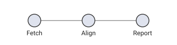
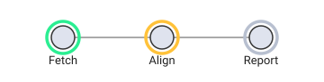
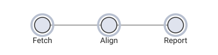
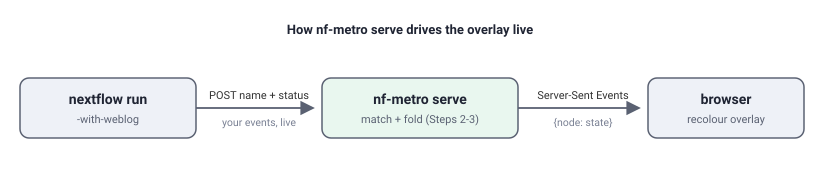

:::note[Stable since 1.0]
The manifest schema, `diagram-manifest` element id, and `data-node-*` attribute names are stable as of nf-metro 1.0 and covered by semantic versioning.
Incompatible schema changes bump the `version` field and the nf-metro major version together.
:::

Every SVG nf-metro renders is a self-describing, addressable artifact.
A downstream tool can position overlays on it, restyle its nodes, and look up which processes a node represents, all from the committed file alone and without re-running whatever drew it.

That contract is not specific to metro maps.
The format is a standalone standard, and nf-metro ships tooling to produce and consume it.
Any diagram tool can emit a conforming SVG, and nf-metro is only the first producer.

:::tip[Start with the tutorial]
If you only want to produce an SVG and drive it from events, skip the spec and go to the [tutorial](#tutorial-light-up-a-diagram-as-a-job-runs).
It builds one from scratch and finishes with a single script you can copy and run.
The sections in between are the format reference, aimed at implementers.
:::

:::note[Headed for its own package]
The tooling lives in `nf_metro.manifest`, a dependency-free module that uses the Python standard library only and imports nothing else from nf-metro.
It is structured so it can later be lifted into its own distribution unchanged.
Until then, import it from nf-metro.
:::

## Terminology

Because the format is tool-neutral, its vocabulary is generic rather than metro-flavoured:

| Term         | Meaning                                                                                                                                                            |
| ------------ | ------------------------------------------------------------------------------------------------------------------------------------------------------------------ |
| **manifest** | The JSON description of the diagram, embedded in the SVG.                                                                                                          |
| **node**     | An addressable point on the diagram, the thing a consumer locates, restyles, or lights up. Has an `id`, a center (`x`/`y`), a radius (`r`), and an optional label. |
| **group**    | An optional **multi-membership** category a node can belong to several of, each with a display `color` (for example, a color-coded series).                        |
| **region**   | An optional **single-membership** container a node sits inside (for example, a labeled box).                                                                       |
| **pattern**  | A regex on a node that identifies it against a runtime string. A node carries zero or more.                                                                        |
| **target**   | What the patterns are matched against, named in the manifest's `match` block (for a Nextflow run, the fully-qualified process name).                               |

A producer with no grouping concept uses `nodes` alone and leaves `groups` and `regions` empty.

### Metro terms and their manifest equivalents

nf-metro draws metro maps.
Its own code, `.mmd` files, and live server therefore speak metro: stations, lines, sections, and processes.
The renderer's adapter translates those into the neutral wire vocabulary, and the SVG you get uses the generic terms defined earlier:

| nf-metro (metro)            | Manifest (neutral) |
| --------------------------- | ------------------ |
| station                     | node               |
| line                        | group              |
| section                     | region             |
| `%%metro process:` patterns | node `patterns`    |

If you author a metro map and then read the rendered SVG, you find `nodes` rather than `stations`.
That translation is what makes the file portable.

## Data carried in the SVG

The data is carried two redundant ways, both sanitization-safe.
Neither uses `<script>`, and both survive the inline-SVG sanitizers a host web app typically runs:

1. A JSON manifest in a `<metadata id="diagram-manifest">` element.
2. `data-node-*` attributes on each node's wrapping `<g>`.

A node's `id` is the join key.
It equals `data-node-id="<id>"` on the element.
A consumer can therefore go from manifest to element and back without guessing.

### Manifest schema

```json
{
  "version": "1.0",
  "match": { "target": "fqProcessName", "type": "regex", "flags": "i" },
  "title": "nf-core/rnaseq",
  "width": 1829,
  "height": 724,
  "groups": [
    { "id": "star_salmon", "label": "STAR + Salmon", "color": "#e64949" }
  ],
  "regions": [{ "id": "preprocessing", "label": "Pre-processing" }],
  "nodes": [
    {
      "id": "fastqc",
      "label": "FastQC",
      "x": 120.0,
      "y": 80.0,
      "r": 5.0,
      "groups": ["star_salmon", "star_rsem"],
      "region": "preprocessing",
      "patterns": ["FASTQC", "MULTIQC"]
    }
  ]
}
```

- `nodes` are the addressable points, covering every node in the diagram.
  Unmapped nodes carry an empty `patterns` list.
  The manifest is therefore a complete inventory rather than only the subset that lights up.
- `id` is the join key and equals `data-node-id="<id>"` on the element.
- **Coordinate space.** `x`/`y`/`r` are absolute SVG user units inside `viewBox="0 0 width height"`, and the producer must emit no outer transform.
  An overlay sharing that viewBox then lines up exactly.
  `r` is a single nominal marker radius.
  Coordinates are rounded to one decimal place.
- `groups` and `regions` are optional metadata.
  A node references them by id through `node.groups` and `node.region`.
- **Forward compatibility.** Consumers MUST ignore unknown fields, and additive fields keep the same major `version`.

A machine-readable JSON Schema (draft 2020-12) ships with the package as `nf_metro/manifest/schema.json`, and `manifest_schema()` returns it as a dict.
Its required fields are exactly the [minimum-conforming](#the-minimum-conforming-file) set.

To validate an SVG, read its manifest out and check it against the schema.
`jsonschema` is not an nf-metro runtime dependency, and `pip install "nf-metro[validate]"` adds it:

```python
import jsonschema
from nf_metro.manifest import read_manifest, manifest_schema

manifest = read_manifest(open("pipeline.svg").read())
if manifest is None:
    raise SystemExit("no diagram manifest embedded in this SVG")
jsonschema.validate(manifest, manifest_schema())   # raises ValidationError if it doesn't conform
```

Or from the command line, without writing any code:

```bash
nf-metro validate-svg pipeline.svg
# Valid: 42 nodes, schema version 1.0   (exits non-zero if it doesn't conform)
```

`validate-svg` needs the same package, and `pip install "nf-metro[validate]"` covers it too.

Add `--geometry` to check the _drawn_ picture as well as the schema.
It flags a route drawn through a station's label or marker, with rail interchanges excepted.
The offset-collapse check, which catches distinct lines merging into one stroke, needs the engine's assigned offsets.
It therefore runs only via [`render --validate`](/nf-metro/cli/#validate-the-rendered-geometry).

```bash
nf-metro validate-svg pipeline.svg --geometry
```

In another language, extract the `<metadata id="diagram-manifest">` JSON the same way and feed it, with the shipped `schema.json`, to any standard JSON Schema validator.

### Per-node attributes

```html
<g
  data-node-id="fastqc"
  data-node-cx="120.0"
  data-node-cy="80.0"
  data-node-r="5.0"
  data-node-groups="star_salmon,star_rsem"
  data-node-region="preprocessing"
>
  ...the node's drawn glyph...
</g>
```

The geometry attributes mirror the manifest's `x`/`y`/`r`.
A consumer can position against either half interchangeably.
`data-node-region` is omitted when the node belongs to no region.
A producer may add its own attributes or classes alongside these, and nf-metro tags the group `nf-metro-station-group`, but only the `data-node-*` set is part of the contract.

### Matching semantics

`patterns` are regular expressions matched case-insensitively against a runtime target string.
The `match` block names the target so that a consumer using neither Python nor Nextflow can reproduce the rule.
For a Nextflow run the target is the fully-qualified process name, such as `NFCORE_RNASEQ:RNASEQ:FASTQC`.
Another producer sets `target` to whatever identifier its own runtime emits.

Keep patterns within the regex subset common to Python `re` and JavaScript `RegExp`, so that two implementations cannot diverge.
That subset covers character classes, anchors, `.`/`*`/`+`/`?`, bounded `{m,n}`, alternation, and groups.
Avoid Python-only constructs such as named groups `(?P<>)`, inline flags `(?i)`, possessive quantifiers, and `\Z`.

A target may legitimately match more than one node.
How to resolve that is a consumer-side policy decision rather than a schema error.

## The minimum conforming file

The shortest path to a file a consumer can drive:

**Required.** An overlay positions itself from these alone:

- An SVG root with `viewBox="0 0 width height"` and no outer transform.
- Exactly one `<metadata id="diagram-manifest">` holding the JSON, with at least `version`, `width`, `height`, and `nodes`, each node carrying an `id` and `x`/`y`/`r`.

**Required only for matching**, such as lighting up nodes from a running job:

- The `match` block (`target`/`type`/`flags`) and a `patterns` list on each node that represents something.

**Recommended.** A consumer can then find and restyle the _drawn_ node in place rather than only overlay on top of it:

- Wrap each node's glyph in a `<g>` with `data-node-id="<id>"` (matching the manifest `id`) and `data-node-cx`/`-cy`/`-r`.

Everything else is optional: `label`, `groups`, `regions`, and the live state model described later.

## The toolkit functions

The whole toolkit is a handful of small functions, all importable from `nf_metro.manifest` and re-exported from `nf_metro.render`.

| Function                                                                                                   | What it does                                                                                                    |
| ---------------------------------------------------------------------------------------------------------- | --------------------------------------------------------------------------------------------------------------- |
| `build_manifest_data(*, title, width, height, nodes, groups=(), regions=(), match_target="fqProcessName")` | Assemble the manifest dict from plain node data. Rounds coordinates and fills the `match` block.                |
| `node_data_attrs(*, id, x, y, r, groups=(), region=None)`                                                  | Return the `data-node-*` attributes for one node's element, as a dict to spread onto your `<g>`.                |
| `manifest_metadata_svg(manifest)`                                                                          | Return only the `<metadata>` element as a string. Use it when you assemble the SVG yourself.                    |
| `inject_manifest(svg, manifest)`                                                                           | Insert that `<metadata>` into an existing SVG string, right after the opening `<svg>` tag. Returns the new SVG. |
| `read_manifest(svg)`                                                                                       | Parse the embedded manifest back out of an SVG string. Returns the dict, or `None` if the SVG has no manifest.  |
| `match_node_ids(manifest, target)`                                                                         | Node ids whose `patterns` match `target`, case-insensitively. Answers which node a runtime name lights up.      |
| `matching_node_ids(target, patterns_by_id)`                                                                | The same matcher over a plain `{id: [pattern]}` map, when your data is not a full manifest.                     |
| `overlay_svg(manifest, body="", *, extra_attrs="")`                                                        | A transparent overlay `<svg>` sized to the manifest's `viewBox`, to stack over the base so coordinates line up. |
| `manifest_json(manifest)`                                                                                  | Deterministic JSON serialization of a manifest, with sorted keys. Rarely needed directly.                       |
| `manifest_schema()`                                                                                        | Return the JSON Schema (draft 2020-12) for a manifest, to validate a producer's output in any language.         |

Producing a file uses the first four.
Consuming one uses `read_manifest` and `match_node_ids`, and a live overlay adds `overlay_svg`.
The two constants `MANIFEST_SCHEMA_VERSION` and `MANIFEST_ELEMENT_ID` (`"diagram-manifest"`) are exported too.

## Produce a conforming SVG

### In Python (any diagram, not only metro maps)

`nf_metro.manifest` builds a manifest from plain node data and embeds it into an SVG you drew by any means.
It never needs a `MetroGraph`:

```python
from nf_metro.manifest import (
    build_manifest_data, node_data_attrs, inject_manifest,
)

manifest = build_manifest_data(
    title="My Tool",
    width=100, height=100,
    nodes=[
        {"id": "trim", "x": 50, "y": 50, "r": 4, "patterns": ["TRIM.*"]},
    ],
)

# Decorate the node's element with the addressable mirror...
attrs = node_data_attrs(id="trim", x=50, y=50, r=4)
attr_str = " ".join(f'{k}="{v}"' for k, v in attrs.items())
svg = f'<svg viewBox="0 0 100 100"><g {attr_str}><circle cx="50" cy="50" r="4"/></g></svg>'

# ...and splice the manifest in after the opening <svg> tag.
svg = inject_manifest(svg, manifest)
```

Each `nodes` entry requires `id`, `x`, `y`, and `r`, and optionally takes `label` (which defaults to `id`), `groups`, `region`, and `patterns`.
Coordinates are rounded for you.
`groups` and `regions` are optional grouping metadata.

A node is addressed as a center point plus a nominal radius, which is overlay-shaped rather than the full glyph outline.
If your nodes are boxes, pass the box center as `x`/`y` and a representative radius for `r`.
An overlay only needs somewhere to anchor, not your exact geometry.

If your runtime does not emit Nextflow process names, set `match_target` to the identifier it does emit.
The file then honestly describes what its `patterns` match:

```python
build_manifest_data(..., match_target="stepName")
# -> "match": { "target": "stepName", "type": "regex", "flags": "i" }
```

### In any language

You do not need this library to produce a conforming file.
Emit the bytes directly:

1. Draw your SVG with `viewBox="0 0 width height"` and no outer transform.
2. Insert a `<metadata id="diagram-manifest">` element holding the JSON shown earlier as CDATA.
   CDATA cannot contain `]]>`.
   If a regex does, split it as `]]]]><![CDATA[>`.
3. _(Recommended)_ For each node, wrap its glyph in a `<g>` carrying a stable `data-node-id` and its center and radius as `data-node-cx`/`-cy`/`-r`, to one decimal place.
   Keep this geometry in agreement with the manifest, because `id` is the join key between them.

## Read and match

`nf_metro.render` re-exports the canonical reader and matcher, which are also available from `nf_metro.manifest`:

```python
from nf_metro.render import read_manifest, match_node_ids

manifest = read_manifest(open("pipeline.svg").read())
match_node_ids(manifest, "NFCORE_RNASEQ:RNASEQ:FASTQC")   # -> ["fastqc"]
```

`read_manifest` is a plain regex extract and needs no XML library.
A consumer in another language reproduces the matcher by walking `nodes[].patterns`, testing each regex case-insensitively against the target, and collecting the `id`s that match.

`match_node_ids` takes a whole manifest, keyed on the schema's `nodes`.
`matching_node_ids` is the same matcher over a plain `id -> [pattern]` mapping, for a producer whose data is not manifest-shaped.

## Drive a live overlay: the state snapshot

Everything earlier defines the static compatibility contract of geometry and addressing.
The second, optional half is the runtime state vocabulary that drives a progress overlay.
A consumer that only needs static addressing can stop at the manifest.

:::tip[Worked example]
The [tutorial](#tutorial-light-up-a-diagram-as-a-job-runs) at the end of this page builds a small pipeline diagram and lights it up from a progress snapshot in about 80 lines.
:::

The manifest gives an overlay everything it needs without a re-render: the `viewBox` to share, and each node's `id`, center, and radius.
The standard fixes the geometry, the addressing, and the state vocabulary defined here, but not the visual style.
How you draw `running` against `done`, whether as a halo, a badge, or a color change on the node itself, is up to you.

### The three layers

Three layers, each narrower than the last:

1. **The standard.** This manifest schema plus the state snapshot schema in this section.
   It is tool-neutral, and any producer can emit it.
2. **A binding.** It turns one runtime's native events into the state snapshot.
   nf-metro ships one binding for Nextflow: the `-with-weblog` HTTP receiver (`nf-metro serve`) and, optionally, the [nf-metro Nextflow plugin](https://github.com/seqeralabs/nf-metro-plugin) that configures it from pipeline config.
   A binding for another workflow engine or CI system would translate that system's own events into the same snapshot shape instead.
3. **nf-metro itself.** One _producer_ of conforming SVGs, and the author of that binding.
   A consumer that already owns authoritative task state, such as a platform that tracks a run's tasks directly, needs only layer 1: the manifest and this state vocabulary.
   It needs neither the weblog server nor the plugin.

### The snapshot shape

A **snapshot** is the full progress picture at one instant: every node's display state, plus the run's own lifecycle state.
The nf-metro live server serves one at `GET /state`, and pushes a fresh one as the `data:` payload of every Server-Sent Event on `GET /stream`:

```json
{
  "run": { "name": "grave_babbage", "state": "running" },
  "stations": {
    "trim": { "state": "done", "done": 2, "total": 2 },
    "qc": { "state": "running", "done": 0, "total": 1 }
  }
}
```

- `stations` is keyed by node id, the same `id` a manifest node and `data-node-id` carry, and a consumer joins the two without any translation.
  A node the runtime has not reported on yet is absent from a hand-built snapshot.
  In the nf-metro server it is present as `{state: "pending", done: 0, total: 0}`, because the server pre-populates every mapped node and a fresh subscriber never sees a missing key.
- `run` is one lifecycle value for the whole snapshot, not one per node.

A machine-readable JSON Schema (draft 2020-12) ships with the package as `nf_metro/live/state_schema.json`, and `state_schema()` returns it as a dict, mirroring `manifest_schema()`:

```python
import jsonschema
from nf_metro.live import state_schema

jsonschema.validate(snapshot, state_schema())   # raises ValidationError if it doesn't conform
```

Unlike the manifest, no `version` field travels inside the snapshot itself, because it is a live response rather than a durable artifact committed to a repo.
The schema file carries its own version on disk as `STATE_SCHEMA_VERSION` (`"1.0"`), and evolves under the same forward-compatibility rule as the manifest.

### The state enum and its transitions

Each station's `state` is one of:

| State     | Meaning                                                                                                                                                                                  |
| --------- | ---------------------------------------------------------------------------------------------------------------------------------------------------------------------------------------- |
| `pending` | No task has been submitted for this node yet. The initial value.                                                                                                                         |
| `queued`  | At least one task has been submitted, and none of them is running yet. `done` may already be greater than 0 if an earlier task for the same node finished before this one was submitted. |
| `running` | At least one task for this node is currently running.                                                                                                                                    |
| `done`    | Every task submitted for this node reached a terminal status, and none of them failed.                                                                                                   |
| `failed`  | **Sticky.** Once any task for this node has failed, it reports `failed` for the rest of the run, even if other tasks for the same node are later running or complete.                    |

When several conditions hold at once, a producer must apply the precedence `failed` > `running` > `queued` > `done` > `pending`, checked in that order.
A node with one failed task and another still running therefore reads `failed`, never `running`.

### `done` / `total` semantics

- `total` is the count of tasks submitted so far for this node in the current run, not a fixed denominator.
  A workflow engine's task count for a node is dynamic, for instance when scattering over samples.
  `total` therefore reflects only what has been _seen_ so far, and it can still grow after the node starts reporting `running`.
- `done` is the count of tasks that have reached a _successful_ terminal status for this node so far.
  A failed task is not counted in `done`.
- Both are cumulative across the run and reset only by a fresh `started` event, described later.
  They never decrease mid-run.

### Run lifecycle

The `run` object's `state` is one lifecycle shared by the whole snapshot:

| State      | Meaning                                                                        |
| ---------- | ------------------------------------------------------------------------------ |
| `idle`     | No run has reported in yet. The initial value, with `name` set to `null`.      |
| `running`  | A run has announced itself as started, and no terminal event has followed yet. |
| `complete` | The run finished successfully.                                                 |
| `error`    | The run (or the binding reporting it) signaled a failure.                      |

Only a fresh `started`-equivalent event moves a run off `complete` or `error`, and doing so resets every station back to `pending`/`0`/`0`.
Re-running the same pipeline therefore re-animates a clean map rather than layering a new run's progress on top of the last one's leftovers.

### Forward compatibility

The rule is the same as for the manifest: consumers MUST ignore unknown fields.
A producer can therefore add fields to `run`, to a station entry, or a wholly new top-level key without breaking an existing reader.
A change that is not purely additive, such as removing a field, changing an enum's existing members, or changing `done`/`total` semantics, is a breaking change.
It bumps the schema file's own version and the nf-metro major version together, exactly as for the manifest.

### Bring your own binding

The nf-metro `serve` command is one reference implementation.
It turns the Nextflow `-with-weblog` task events into the snapshot shown earlier, mapping `process_submitted` to `queued`, `process_started` to `running`, and `process_completed` to `done` or `failed` depending on status.
It then draws a glowing halo per node and recolors it by state (see [Live progress](/nf-metro/live/)).
A host application can write its own binding from its own runtime's events to this same snapshot shape.
It can map the state vocabulary onto its own visual language, whether that is filled badges, a progress bar, or a color change on the node itself.

## Tutorial: light up a diagram as a job runs

A complete, self-contained example for a tool that is not nf-metro.
By the end you will have a small pipeline diagram that shows progress as work happens.
Every snippet runs as written, with no pipeline, no server, and no Nextflow, because the progress is faked.
It comes to about 80 lines and uses only `nf_metro.manifest`.

**The idea.** Draw the diagram _once_ and embed a manifest in it.
Then, whenever progress changes, draw a thin overlay of status markers on top.
The diagram itself never re-flows, and only the lightweight overlay updates.
The example models a three-step pipeline: Fetch, Align, and Report.

**What's doing the work.** The only library is `nf_metro.manifest`, the standard-library-only module described earlier.
There is no `MetroGraph`, no nf-metro renderer, and no drawing or templating library.
We assemble the SVG as plain Python strings and use `nf_metro.manifest` for four manifest-specific jobs: building it (`build_manifest_data`), embedding it (`node_data_attrs`, `inject_manifest`), reading it back (`read_manifest`), and matching runtime names to nodes (`match_node_ids`).

### Step 1 - draw the diagram and embed a manifest

We hand-draw three circles, one per step, wrap each in a `<g>` carrying its `data-node-*` attributes, and splice in the manifest.

- **For now**, the fields that matter are `id` and `x`/`y`/`r`: the node's name, where it sits, and how big it is.
  An overlay anchors to these.
- **Later**, `patterns` (the names this node answers to) and `match_target` matter for Step 2's matching.
  Ignore them until then.
  Because this example matches against step names, it sets `match_target="stepName"`.

```python
from nf_metro.manifest import (
    build_manifest_data, node_data_attrs, inject_manifest,
    read_manifest, match_node_ids,
)

NODES = [
    {"id": "fetch",  "label": "Fetch",  "x": 70,  "y": 42, "r": 13, "patterns": ["FETCH"]},
    {"id": "align",  "label": "Align",  "x": 180, "y": 42, "r": 13, "patterns": ["BWA.*", "STAR.*"]},
    {"id": "report", "label": "Report", "x": 290, "y": 42, "r": 13, "patterns": ["MULTIQC"]},
]
W, H = 360, 92

def node_svg(n):
    attrs = " ".join(
        f'{k}="{v}"'
        for k, v in node_data_attrs(id=n["id"], x=n["x"], y=n["y"], r=n["r"]).items()
    )
    return (
        f'<g {attrs}>'
        f'<circle cx="{n["x"]}" cy="{n["y"]}" r="{n["r"]}" fill="#dfe3ee" stroke="#333"/>'
        f'<text x="{n["x"]}" y="{n["y"] + 30}" text-anchor="middle" font-size="13">{n["label"]}</text>'
        f'</g>'
    )

edges = (
    '<line x1="83" y1="42" x2="167" y2="42" stroke="#aaa"/>'
    '<line x1="193" y1="42" x2="277" y2="42" stroke="#aaa"/>'
)
base = (
    f'<svg xmlns="http://www.w3.org/2000/svg" viewBox="0 0 {W} {H}" width="{W}" height="{H}">'
    f'{edges}{"".join(node_svg(n) for n in NODES)}</svg>'
)
svg = inject_manifest(
    base,
    build_manifest_data(
        title="Toy pipeline", width=W, height=H, nodes=NODES, match_target="stepName"
    ),
)
```

Three functions did the work.
`node_data_attrs` produced each node's `data-node-*` attributes, `build_manifest_data` assembled the manifest from the node list, and `inject_manifest` placed that manifest inside the SVG.
`svg` is now a self-describing file: three labeled nodes, a `<metadata id="diagram-manifest">` block, and `data-node-*` attributes.
Save it to a `.svg` if you like, because everything later works from that file alone.



### Step 2 - connect the diagram to the work

Something has to _run_ your pipeline's steps, whether that is a workflow engine, a CI job, or a plain script.
Call it the **runtime**.
As it works, it announces each step by a **name**: it might log that a step called `BWA_MEM` has started, then that it finished.

Those names cause two problems.
You usually do not choose them, because a tool may call your "Align" step `BWA_MEM` or `STAR_ALIGN`.
They also rarely equal your node ids.
Each node's `patterns` exist for exactly this: regexes that match the names _your_ runtime uses.
`match_node_ids` answers which node a name belongs to:

```python
manifest = read_manifest(svg)

match_node_ids(manifest, "BWA_MEM")   # -> ['align']
match_node_ids(manifest, "multiqc")   # -> ['report']  (matching is case-insensitive)
```

Nothing is running yet, and this only queries the file.
Matching is the bridge from "a name the runtime mentioned" to "a node on the diagram".

### Step 3 - show progress

Give each node a **state**, one of `pending`, `queued`, `running`, `done`, or `failed`, and draw a colored ring per node at its manifest position.
The colors are your choice, because the standard only tells you _where_ each node is:

```python
COLORS = {
    "pending": "#b8c0d0", "queued": "#ffb020",
    "running": "#ffc23a", "done": "#2bee92", "failed": "#ff4d4d",
}

def progress_halos(manifest, states):
    """One status ring per node, positioned from the manifest geometry."""
    return "".join(
        f'<circle cx="{n["x"]}" cy="{n["y"]}" r="{n["r"] + 5}" fill="none" '
        f'stroke="{COLORS[states.get(n["id"], "pending")]}" stroke-width="3.5"/>'
        for n in manifest["nodes"]
    )
```

A tutorial has no real runtime.
Simulate one instead.
The list that follows holds `(step_name, new_state)` announcements of the kind a real engine sends as a run progresses.
Fold each one into a `{node_id: state}` map using Step 2's matcher, then redraw the overlay.
That sequence of redraws _is_ the animation:

```python
# A real runtime would send these live; we hard-code them so the tutorial runs
# on its own.
events = [
    ("FETCH",   "running"), ("FETCH",   "done"),
    ("BWA_MEM", "running"), ("BWA_MEM", "done"),   # the Align step, by its tool name
    ("MULTIQC", "running"), ("MULTIQC", "done"),   # the Report step
]

states = {}
for name, new_state in events:
    for node_id in match_node_ids(manifest, name):
        states[node_id] = new_state
    frame = svg.replace("</svg>", progress_halos(manifest, states) + "</svg>")
    # draw `frame`: write it to a file, or update the page in a browser
```

A single frame taken just after Fetch finished and Align started, when `states` is `{"fetch": "done", "align": "running"}`, looks like this.
Green is done, amber is running, and gray is still pending:



Replaying the whole `events` list redraws the overlay step by step and animates the run from start to finish:



The rings are deliberately plain.
Swap in pulses, fills, per-node counts, or your own palette without touching the contract.

### Step 4 - plug in a real runtime

Up to now everything ran in one Python script.
In a real system the same logic splits between an **event source**, whatever runs your pipeline, and a **UI**, usually a browser.
Only one thing in this tutorial was fake: the hard-coded `events` list.
Replace it with announcements from a real run and nothing else changes.
You still `match_node_ids` each name to a node (Step 2) and fold it into the `states` map that `progress_halos` draws (Step 3).

**What Nextflow does, in the tutorial's terms.** Run a pipeline with `nextflow run ... -with-weblog http://localhost:8080/events` and Nextflow becomes the source of that `events` list.
Every time a task is submitted, starts, or finishes, it POSTs a small JSON message to that URL carrying the process name and its status.
It sends you `("BWA_MEM", "running")`, then `("BWA_MEM", "done")`, live, instead of you writing them out.

**What `nf-metro serve` is.** This same tutorial running as a small web server.
You write none of the Python yourself:

1. It renders the diagram's SVG once and builds an overlay of one ring per node, positioned from each node's coordinates, on the same principle as `progress_halos`.
2. It listens on `http://localhost:8080/`, where `/events` is the URL Nextflow POSTs to.
3. On each message it runs Step 2 (`match_node_ids` on the process name) and Step 3 (fold the result into a per-node `states` map).
4. It pushes the updated `states` to the open browser page over [Server-Sent Events](https://developer.mozilla.org/en-US/docs/Web/API/Server-sent_events), and the page recolors the matching overlay ring.



`nf-metro serve` is therefore this tutorial connected to a live event source and a browser.
See [Live progress](/nf-metro/live/) to run it.
That page also covers the multi-run dashboard and the optional Nextflow plugin.
The glowing-LED styling there is its own choice, and yours can differ.

**Doing it yourself in a browser** takes the same three steps client-side: `read_manifest` on the committed SVG, `match_node_ids` per incoming event, then restyle the matched node.
Keep the overlay as a separate layer over the base so you never redraw the diagram.
`overlay_svg` builds one sized to match, and coordinates line up:

```python
from nf_metro.manifest import overlay_svg

# a transparent layer the same size/viewBox as the base, holding the rings:
layer = overlay_svg(manifest, progress_halos(manifest, states),
                    extra_attrs='style="pointer-events:none"')
# stack `layer` directly over the base SVG; on each event, update its rings.
```

### The complete script

Everything earlier as one file.
It needs only nf-metro installed (`pip install nf-metro`), and it writes the diagram plus one frame per event, with no pipeline or server.
Save it as `demo.py`, run `python demo.py`, then open `toy_pipeline.svg` and the `progress_*.svg` frames in order.
You should get one static diagram plus six frames that turn Fetch, then Align, then Report from gray through amber to green, with the terminal printing each event as it maps to a node.

```python
"""Make a conforming SVG and drive it from a stream of (step, state) events.

Uses only nf_metro.manifest (Python standard library only) - no pipeline, no
server. Run `python demo.py`, then open toy_pipeline.svg and progress_*.svg.
"""

from nf_metro.manifest import (
    build_manifest_data, node_data_attrs, inject_manifest,
    read_manifest, match_node_ids,
)

# --- the diagram: one node per pipeline step --------------------------------
NODES = [
    {"id": "fetch",  "label": "Fetch",  "x": 70,  "y": 42, "r": 13, "patterns": ["FETCH"]},
    {"id": "align",  "label": "Align",  "x": 180, "y": 42, "r": 13, "patterns": ["BWA.*", "STAR.*"]},
    {"id": "report", "label": "Report", "x": 290, "y": 42, "r": 13, "patterns": ["MULTIQC"]},
]
W, H = 360, 92

def node_svg(n):
    attrs = " ".join(
        f'{k}="{v}"'
        for k, v in node_data_attrs(id=n["id"], x=n["x"], y=n["y"], r=n["r"]).items()
    )
    return (
        f'<g {attrs}>'
        f'<circle cx="{n["x"]}" cy="{n["y"]}" r="{n["r"]}" fill="#dfe3ee" stroke="#333"/>'
        f'<text x="{n["x"]}" y="{n["y"] + 30}" text-anchor="middle" font-size="13">{n["label"]}</text>'
        f'</g>'
    )

edges = (
    '<line x1="83" y1="42" x2="167" y2="42" stroke="#aaa"/>'
    '<line x1="193" y1="42" x2="277" y2="42" stroke="#aaa"/>'
)
base = (
    f'<svg xmlns="http://www.w3.org/2000/svg" viewBox="0 0 {W} {H}" width="{W}" height="{H}">'
    f'{edges}{"".join(node_svg(n) for n in NODES)}</svg>'
)
svg = inject_manifest(
    base,
    build_manifest_data(
        title="Toy pipeline", width=W, height=H, nodes=NODES, match_target="stepName"
    ),
)
with open("toy_pipeline.svg", "w") as f:
    f.write(svg)
print("wrote toy_pipeline.svg  (the conforming diagram)")

# --- drive it from a stream of events ---------------------------------------
COLORS = {
    "pending": "#b8c0d0", "queued": "#ffb020",
    "running": "#ffc23a", "done": "#2bee92", "failed": "#ff4d4d",
}

def progress_halos(manifest, states):
    return "".join(
        f'<circle cx="{n["x"]}" cy="{n["y"]}" r="{n["r"] + 5}" fill="none" '
        f'stroke="{COLORS[states.get(n["id"], "pending")]}" stroke-width="3.5"/>'
        for n in manifest["nodes"]
    )

# In a real run these arrive live (e.g. from Nextflow's -with-weblog); here we
# hard-code them so the demo runs on its own.
events = [
    ("FETCH",   "running"), ("FETCH",   "done"),
    ("BWA_MEM", "running"), ("BWA_MEM", "done"),   # the Align step, by its tool name
    ("MULTIQC", "running"), ("MULTIQC", "done"),   # the Report step
]

manifest = read_manifest(svg)
states = {}
for i, (name, state) in enumerate(events):
    hits = match_node_ids(manifest, name)        # which node(s) does this name light up?
    for node_id in hits:
        states[node_id] = state
    frame = svg.replace("</svg>", progress_halos(manifest, states) + "</svg>")
    with open(f"progress_{i}.svg", "w") as f:
        f.write(frame)
    print(f"  event {name:<8} {state:<8} -> {hits}")

print(f"wrote progress_0.svg .. progress_{len(events) - 1}.svg  (open them in order)")
```

Swap the hard-coded `events` for messages from your real runtime, or let `nf-metro serve` do it as in Step 4, and the same loop drives a live diagram.
