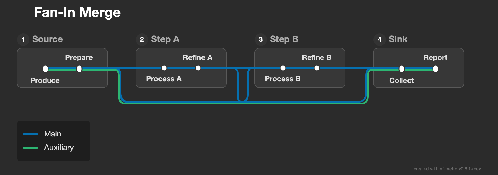

# Topology Examples

Example `.mmd` files demonstrating a range of pipeline topologies and the layout patterns they produce. Each example exercises different aspects of the auto-layout engine.

To render all examples:

```bash
nf-metro render examples/topologies/wide_fan_out.mmd -o /tmp/wide_fan_out.svg
```

---

## Structural class index

Each fixture is tagged with the layout class(es) it primarily exercises. Use this table to find a fixture that stresses a specific engine subsystem.

| Fixture | Structural class(es) |
|---|---|
| `single_section.mmd` | minimal / no-port edge case |
| `deep_linear.mmd` | linear chain / fold threshold |
| `parallel_independent.mmd` | disconnected components / row stacking |
| `wide_fan_out.mmd` | wide fan-out / junction creation |
| `wide_fan_in.mmd` | wide fan-in / bundle ordering at L-corners |
| `fan_in_merge.mmd` | same-line fan-in / merge-junction routing |
| `multi_input_convergence.mmd` | single-line multi-source convergence |
| `section_diamond.mmd` | section-level fork-join |
| `shared_sink_parallel.mmd` | parallel multi-line branches with shared source and sink |
| `asymmetric_tree.mmd` | unbalanced branching / variable branch depth |
| `complex_multipath.mmd` | per-line route variation / bundle slot reservation |
| `multi_line_bundle.mmd` | dense bundle / tall station pills |
| `mismatched_tracks.mmd` | per-line track mismatch between sections |
| `mixed_bundle_column.mmd` | mixed-cardinality fan-out into stacked column |
| `mixed_port_sides.mmd` | multi-side exit ports (RIGHT + BOTTOM) |
| `upward_bypass.mmd` | tall section bypass (upward gap) |
| `rnaseq_lite.mmd` | realistic pipeline / TB+LR mix / diamond |
| `variant_calling.mmd` | realistic pipeline / asymmetric fork-join / 4-way fan-in |
| `funcprofiler_upstream.mmd` | dense fan-out + fan-in / known almost-horizontal defect |
| `fold_fan_across.mmd` | fan-in/out across fold boundary / rowspan optimization |
| `fold_double.mmd` | double-fold serpentine (LR -> RL -> LR) |
| `fold_stacked_branch.mmd` | stacked branches feeding through fold |
| `u_turn_fold.mmd` | fold with side line joining mid-trunk and leaving pre-end |

---

## Simple Topologies

### Single Section

A minimal pipeline with one section and one line. Tests the simplest case: no ports, no inter-section routing, no grid placement.


### Deep Linear Chain

Seven sections connected in a straight chain with two lines. Exercises the grid fold threshold, where sections wrap to a second row when the chain gets too long.


### Parallel Independent

Two completely disconnected two-section pipelines (DNA and RNA). Tests row stacking of independent components that share no edges.


---

## Fan-out and Fan-in

### Wide Fan-Out

One source section fanning out to four target sections, each carrying a different line. Tests junction creation, vertical stacking of sections in a single column, and port spacing when many lines diverge at once.


### Wide Fan-In

Four source sections converging into one target section. The inverse of fan-out: tests bundle ordering around L-shaped corners when multiple entry edges arrive from stacked sources.


### Fan-In Merge

Same-line convergence: one line fans out from the source to all downstream sections, then reconverges at the sink. Each intermediate section also forwards to all subsequent sections, creating multiple bypass routes of the same line targeting one entry port. Tests merge junction insertion and trunk/branch routing, where the farthest bypass carries the full route and closer sources drop down to join it.



### Section Diamond

A section-level fork-join: one source fans out to two parallel sections, which then reconverge into a single sink. Tests both fan-out junction creation and fan-in routing in the same topology.


---

## Branching and Multipath

### Asymmetric Tree

One root section branching into three paths of different depths (1, 2, and 3 sections deep). Tests unbalanced tree layout where branches occupy different numbers of grid columns.


### Complex Multipath

Four lines taking different routes through six sections. Some lines skip sections entirely, others take detours through extra sections. Tests global bundle position reservation: when a line splits off and later rejoins, it returns to the same slot in the bundle.


---

## Multi-line Bundles

### Multi-Line Bundle

Six lines travelling through the same three-section chain. Tests dense bundle rendering: station pill height, line offset stacking, and routing of thick bundles through inter-section gaps.


### Mixed Port Sides

A section with both RIGHT and BOTTOM exits, sending lines in two directions. Tests multi-side exit port placement and the combination of horizontal and vertical inter-section routing from the same source.


---

## Realistic Pipelines

### RNA-seq Lite

A simplified RNA-seq pipeline with three analysis routes (STAR + Salmon, HISAT2, pseudo-alignment) diverging after a shared preprocessing section. Includes diamond patterns (FastP/Trim Galore) and line reconvergence at post-processing.


### Variant Calling Pipeline

A variant calling pipeline with four lines (Whole Genome, Whole Exome, Targeted Panel, RNA Variants) sharing alignment but diverging to different callers before reconverging at annotation. Tests complex fork-join patterns with asymmetric branch depths.


---

## Fold Topologies

These examples trigger the auto-layout engine's **fold logic**, which wraps long pipelines into a serpentine layout when cumulative station layers exceed the fold threshold (default 15 columns). The threshold is configurable via `--max-layers-per-row`:

```bash
# Narrower layout with more folds
nf-metro render examples/topologies/deep_linear.mmd -o output.svg --max-layers-per-row 6

# Wider layout with fewer folds
nf-metro render examples/topologies/deep_linear.mmd -o output.svg --max-layers-per-row 20
```

### Fold Fan-Across

Three lines (TMT, Label-Free, DIA) diverge from a wide preprocessing section into three stacked quantification sections, then converge at a fold section (Normalization) before continuing on the return row. Tests junction creation across fold boundaries, rowspan optimization for the TB bridge, and post-fold RL direction inference.


### Fold Double (Serpentine)

A ten-section linear pipeline with two fold points, producing a true serpentine layout: LR on row 0, RL on row 1, LR on row 2. Tests the col_step zigzag toggle, ensuring the third row flows correctly instead of producing negative grid columns.


### Fold Stacked Branch

Three stacked analysis sections (RNA, ATAC, Protein) feed into a fold section (Integration) that fans out to two stacked targets (Biological Interpretation, Technical QC) on the return row, converging into a final report. Tests rowspan optimization, fan-out from a TB fold section, and post-fold stacked branching.


### U-Turn Fold

Long linear pipeline whose main line wraps via a fold into a return row, with a secondary line joining mid-trunk and exiting before the end. Tests fold rowspan transitions while a partial-coverage line shares the trunk only across a sub-range of sections.

---

## Structural Stress Tests

These fixtures don't appear in the gallery but back the topology validation suite.

### Multi-Input Convergence

Four independent single-station source sections all feeding the same `Merge` station in a sink section, all carrying one shared line. Tests single-line fan-in with sources stacked in a column.

### Shared Sink Parallel

One source feeds three structurally identical parallel branches that all converge into one sink. Every section carries the same 3-line bundle. Tests parallel multi-line trunks sharing a common source and a common sink.

### Mixed Bundle Column

One stacked column contains three siblings of different line counts: a 3-line branch, a 1-line branch, and a 1-line branch, all sourced from the same upstream section and converging at a shared sink. Tests fan-out from a wide bundle into mixed-cardinality siblings in the same grid column.

### Funcprofiler Upstream

Reduced upstream slice of nf-core/funcprofiler with one input section fanning out to seven profiler tools and back into a MultiQC section. Pinned via xfail in `test_no_almost_horizontal_edges` - documents a known almost-horizontal-edge defect in dense fan-out + fan-in topologies.
