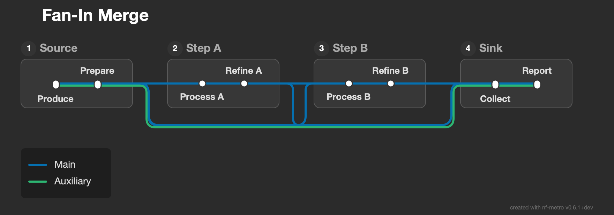

# Topology Examples

Example `.mmd` files demonstrating a range of pipeline topologies and the layout patterns they produce. Each example exercises different aspects of the auto-layout engine.

This directory holds 286 fixtures and every one of them is named in this file: the illustrated ones in the walkthrough sections below, the rest in the [Regression Catalogue](#regression-catalogue).

To render one example:

```bash
nf-metro render examples/topologies/wide_fan_out.mmd -o /tmp/wide_fan_out.svg
```

The sweep tests glob this whole directory, so a fixture is exercised whether or
not it is catalogued here: `tests/test_topology_validation.py` runs every
validator check against every `.mmd`, and `tests/test_layout_invariants.py`
sweeps the same set. `python scripts/list_topology_fixtures.py` prints the
fixtures on disk with their `%%metro title:` and names any that this file has
missed.

---

## Structural class index

The fixtures below are tagged with the layout class(es) they primarily exercise. Use this table to find one that stresses a specific engine subsystem; the remaining fixtures are grouped by theme in the [Regression Catalogue](#regression-catalogue).

| Fixture                                      | Structural class(es)                                                                                                                                                                                                                  |
| -------------------------------------------- | ------------------------------------------------------------------------------------------------------------------------------------------------------------------------------------------------------------------------------------- |
| `single_section.mmd`                         | minimal / no-port edge case                                                                                                                                                                                                           |
| `deep_linear.mmd`                            | linear chain / fold threshold                                                                                                                                                                                                         |
| `parallel_independent.mmd`                   | disconnected components / row stacking                                                                                                                                                                                                |
| `disconnected_components_fold.mmd`           | disconnected components under folding / grid rows renormalised to stack order so the inter-row cascade keeps the standalone section clear of the folded trunk (issue #1164)                                                           |
| `wide_fan_out.mmd`                           | wide fan-out / junction creation                                                                                                                                                                                                      |
| `wide_fan_in.mmd`                            | wide fan-in / bundle ordering at L-corners                                                                                                                                                                                            |
| `fan_in_merge.mmd`                           | same-line fan-in / merge-junction routing                                                                                                                                                                                             |
| `multi_input_convergence.mmd`                | single-line multi-source convergence                                                                                                                                                                                                  |
| `section_diamond.mmd`                        | section-level fork-join                                                                                                                                                                                                               |
| `uneven_diamond.mmd`                         | fork-join with unequal-length branches / distinct track per branch (issue #610)                                                                                                                                                       |
| `symmetric_diamond_beside_wide_fan.mmd`      | symmetric 2-way diamond sharing a section with a wider fan; compacts to a half-pitch bubble while the fan keeps full-pitch slots (issue #1076)                                                                                        |
| `even_symmetric_fan_hub_join_centreline.mmd` | six-branch `diamond_style: symmetric` fan-out/fan-in; the fork hub and join hub sit on the same half-pitch centreline rather than a full pitch apart (issue #1595)                                                                    |
| `trunkless_entry_fan_reconverge_centre.mmd`  | a trunkless multi-line entry-port fan (no arm carries every line, one arm has an extra internal hop) reconverging on a single join under `diamond_style: symmetric`; the join lands on the fan's served-span centreline (issue #1848) |
| `shared_sink_parallel.mmd`                   | parallel multi-line branches with shared source and sink                                                                                                                                                                              |
| `convergence_sink_above.mmd`                 | input section above its convergence sink, line declared last / entry lanes slotted by feeder approach not declaration order (issue #1204)                                                                                             |
| `top_descent_over_left_entry.mmd`            | a line descending into a shared LEFT entry port from a section above takes the topmost lane rather than diving under the level left feeder                                                                                            |
| `top_descent_over_left_entry_junction.mmd`   | same as above but the descending feeder arrives through a fan-out junction (no section to count), so feeder height decides the lane order (issue #1410)                                                                               |
| `asymmetric_tree.mmd`                        | unbalanced branching / variable branch depth                                                                                                                                                                                          |
| `complex_multipath.mmd`                      | per-line route variation / bundle slot reservation                                                                                                                                                                                    |
| `trunk_through_fan.mmd`                      | trunk bundle entering and exiting a section that has an internal fork-join diamond                                                                                                                                                    |
| `terminal_symmetric_fan.mmd`                 | two-line bundle fanning out to three terminal nodes in a reporting section (no inter-terminal edges)                                                                                                                                  |
| `multi_line_bundle.mmd`                      | dense bundle / tall station pills                                                                                                                                                                                                     |
| `file_node_with_outgoing_edge.mmd`           | file-icon metadata on a produced artifact that also feeds a downstream consumer (issue #1570)                                                                                                                                         |
| `exit_run_three_drop_columns.mmd`            | three lines off one exit junction turning down through three different handlers / one shared fan corner column, lanes ordered by destination row so a returning and a continuing trunk nest in the inter-row band (issue #1594)       |
| `leftward_up_exit_turn_order.mmd`            | two lines on one leftward exit run turn upward without transposing their source-lane order, including a repeated same-line arrival from another section                                                                               |
| `terminated_exit_lane_compaction.mmd`        | three active lines close the lane slot left by a fourth line that terminates before their shared exit                                                                                                                                 |
| `bottom_exit_stacked_right_entry_fan.mmd`    | bottom-exit bundle opening into stacked right-entry targets / planned landing order and exact offset slots                                                                                                                            |
| `fan_branch_additional_outputs.mmd`          | six-way diamond whose branches also emit reporting outputs / complete branch membership beyond the join                                                                                                                               |
| `port_fed_three_branch_diamond.mmd`          | three-line diamond fed directly through a section entry port / frozen centreline and branch lanes                                                                                                                                     |
| `seed72_cross_family_fan.mmd`                | fan whose branches use different routing families / structural ownership separated from dedicated route emission                                                                                                                      |
| `recompacted_fanout_exit.mmd`                | three-line fan-out with exit-port and junction offsets recompacted into one contiguous 4 px frame                                                                                                                                     |
| `same_destination_short_overlap.mmd`         | same-direction H-V-H feeders whose final vertical overlap is shorter than two curve radii and must be left in place                                                                                                                   |
| `same_destination_vertical_convergence.mmd`  | the reproducer published in #1764; multi-row same-direction convergence onto one side-entry port, adjacent final approaches, and the #1746 settlement of an approach bundle across a planned exempt multi-row riser                   |
| `interchange_lane_reorder.mmd`               | auto-interchange / interleaving-lane reorder (issue #779)                                                                                                                                                                             |
| `mismatched_tracks.mmd`                      | per-line track mismatch between sections                                                                                                                                                                                              |
| `mixed_bundle_column.mmd`                    | mixed-cardinality fan-out into stacked column                                                                                                                                                                                         |
| `mixed_port_sides.mmd`                       | multi-side exit ports (RIGHT + BOTTOM)                                                                                                                                                                                                |
| `off_track_convergence.mmd`                  | multiple off-track inputs converging on one consumer                                                                                                                                                                                  |
| `off_track_convergence_multiline.mmd`        | multiple off-track inputs converging on one consumer, carrying multiple lines                                                                                                                                                         |
| `tb_off_track_inputs.mmd`                    | `direction: TB` section with off-track file inputs and an output offset beside the vertical trunk on the cross (X) axis rather than stacked on it (issue #1381)                                                                       |
| `tb_off_track_output_row.mmd`                | `direction: TB` trunk feeding off-track outputs; each output hangs off its producer via an S (flow-axis lead, diagonal, flat tail) on the non-label side, not perpendicular or in a neighbour's label lane (issue #1384)              |
| `upward_bypass.mmd`                          | tall section bypass (upward gap)                                                                                                                                                                                                      |
| `bypass_label_rake.mmd`                      | bypass V climbs clear of a wide bypassed-station label                                                                                                                                                                                |
| `rnaseq_lite.mmd`                            | realistic pipeline / TB+LR mix / diamond                                                                                                                                                                                              |
| `variant_calling.mmd`                        | realistic pipeline / asymmetric fork-join / 4-way fan-in                                                                                                                                                                              |
| `funcprofiler_upstream.mmd`                  | dense fan-out + fan-in / known almost-horizontal defect                                                                                                                                                                               |
| `fold_fan_across.mmd`                        | fan-in/out across fold boundary / rowspan optimization                                                                                                                                                                                |
| `fold_double.mmd`                            | double-fold serpentine (LR -> RL -> LR)                                                                                                                                                                                               |
| `serpentine_rl_right_entry_bundle.mmd`       | two-line boustrophedon fold with both rows packed into one grid cell, so the RIGHT exit descends straight into the return row's RIGHT entry; that half-turn re-nests the bundle across the fold (issue #1767)                         |
| `fold_stacked_branch.mmd`                    | stacked branches feeding through fold                                                                                                                                                                                                 |
| `convergence_sink_fold.mmd`                  | convergence sink folded below stacked branches / feeders route around intervening boxes into the TOP entry (issue #1148)                                                                                                              |
| `tb_fork_lane_transpose.mmd`                 | TB section trunk station forking to an in-section file terminus and a side exit / bypass helper rides the lane side so the fork legs don't cross (issue #1163)                                                                        |
| `u_turn_fold.mmd`                            | fold with side line joining mid-trunk and leaving pre-end                                                                                                                                                                             |
| `branch_fold_stability.mmd`                  | wide side branch at its fold threshold / intra-section edit must not re-grid the downstream consumer (issue #1082)                                                                                                                    |
| `wide_label_fan.mmd`                         | wide station labels / auto label-wrap + column-spread (issue #405)                                                                                                                                                                    |
| `wrapped_label_trunk.mmd`                    | wrapped label on a lower track pulled off the metro line above (issue #617)                                                                                                                                                           |
| `route_around_intervening.mmd`               | inter-section line detouring around an intervening section box (issue #484)                                                                                                                                                           |
| `self_crossing_bridge.mmd`                   | same-colour self-crossing bridge glyph (issue #484)                                                                                                                                                                                   |
| `convergence_stacked_sink.mmd`               | convergence return-row stacked-sibling migration (issue #484)                                                                                                                                                                         |
| `cross_row_gap_wrap.mmd`                     | cross-row feed wrapping via the inter-row gap, no counter-flow (issue #484)                                                                                                                                                           |
| `stacked_lr_serpentine.mmd`                  | tall rowspan section alongside stacked single-row sections in the same column                                                                                                                                                         |
| `around_section_below.mmd`                   | inter-section edge routing around a section that sits below and between source and target                                                                                                                                             |
| `inter_row_wrap_clearance.mmd`               | three-line bundle exiting a top section right and entering a bottom section left via the inter-row gap                                                                                                                                |
| `tb_bottom_entry_flow_start.mmd`             | flow-axis entry declared opposite its consumer (TB `entry: bottom` feeding the top station) re-anchored so the line does not fold back through the trunk (issue #885)                                                                 |
| `tb_lr_exit_left.mmd`                        | TB section leaving through a LEFT exit into a section below-left (`_route_tb_lr_exit` LEFT arm) (issue #917)                                                                                                                          |
| `tb_left_exit_step.mmd`                      | TB section LEFT exit into a lower right-entry section: the exit bundle steps west-down-west and is routed as a parallel staircase that keeps the feed order (issue #671)                                                              |
| `tb_lr_exit_right.mmd`                       | TB section leaving through a RIGHT exit into the next forward section (`_route_tb_lr_exit` RIGHT arm) (issue #917)                                                                                                                    |
| `tb_internal_diagonal.mmd`                   | symmetric fan-out inside a TB section onto X tracks either side of the hub, routing both internal edges as 45-degree diagonals (`_route_tb_internal` diagonal arm) (issue #917)                                                       |
| `fold_bypass_creep.mmd`                      | folded vertical bridge; a forking qc line bypasses a file terminus into a downstream section, whose placement converges in both validate modes (issue #1171)                                                                          |
| `fold_bypass_creep_tight.mmd`                | tight fold bypass; the file terminus is one row below the fork so the bypass V seats on the trailing row, and the perp exit corridor must clear it by a full station flat (issue #1177)                                               |
| `reversed_section_junction_reseat.mmd`       | reversed (RL) section entered near-vertically through a RIGHT port feeds a downstream reversed section whose exit-port divergence junction re-seats onto the reversed lane order (issue #1816)                                        |
| `row_trunk_partial_through_line.mmd`         | packed row whose last member is entered by one line of the row bundle, that line also fanning to another grid row; the member's trunk stays on the row's trunk Y with its off-track output one lane above (issue #1844)               |
| `packed_cell_cellmate_bypass_no_handoff.mmd` | packed cell whose far member and a following section are both entered over a cell-mate, with no sibling hop able to carry a shared descent, so no hand-over is taken (issue #1844)                                                    |

---

## Simple Topologies

### Single Section

A minimal pipeline with one section and one line. Tests the simplest case: no ports, no inter-section routing, no grid placement.


### Deep Linear Chain

Seven sections connected in a straight chain with two lines. Exercises the grid fold threshold, where sections wrap to a second row when the chain gets too long.


### Parallel Independent

Two completely disconnected two-section pipelines (DNA and RNA). Tests row stacking of independent components that share no edges.


---

## Fan-out and Fan-in

### Wide Fan-Out

One source section fanning out to four target sections, each carrying a different line. Tests junction creation, vertical stacking of sections in a single column, and port spacing when many lines diverge at once.


### Wide Fan-In

Four source sections converging into one target section. The inverse of fan-out: tests bundle ordering around L-shaped corners when multiple entry edges arrive from stacked sources.


### Fan-In Merge

Same-line convergence: one line fans out from the source to all downstream sections, then reconverges at the sink. Each intermediate section also forwards to all subsequent sections, creating multiple bypass routes of the same line targeting one entry port. Tests merge junction insertion and trunk/branch routing, where the farthest bypass carries the full route and closer sources drop down to join it.



### Section Diamond

A section-level fork-join: one source fans out to two parallel sections, which then reconverge into a single sink. Tests both fan-out junction creation and fan-in routing in the same topology.

### Terminal Symmetric Fan

A two-line bundle from a source section fans out to three independent terminal nodes (Shiny, MultiQC, Quarto) inside a reporting section. The terminals share no edges with each other. Tests fan-out routing where all targets are leaf nodes within a single entry-port section.

### Trunk Through Fan

Source and sink sections are connected through a middle section that contains an internal fork-join diamond (Split → Path Up/Down → Join). The two-line bundle enters the middle section, passes through the diamond, and exits as the same bundle into the sink. Tests that a trunk bundle is preserved end-to-end through a section whose interior contains parallel branches.


### Uneven Diamond

A node-level fork-join where one branch (`b`) runs through an extra station before rejoining the shared sink while the other two branches (`a`, `c`) reach it directly. The branch length difference must not collapse the shorter branches onto a single track: each of the three branches gets a distinct track (issue #610).

---

## Branching and Multipath

### Asymmetric Tree

One root section branching into three paths of different depths (1, 2, and 3 sections deep). Tests unbalanced tree layout where branches occupy different numbers of grid columns.


### Complex Multipath

Four lines taking different routes through six sections. Some lines skip sections entirely, others take detours through extra sections. Tests global bundle position reservation: when a line splits off and later rejoins, it returns to the same slot in the bundle.


---

## Multi-line Bundles

### Multi-Line Bundle

Six lines travelling through the same three-section chain. Tests dense bundle rendering: station pill height, line offset stacking, and routing of thick bundles through inter-section gaps.


### Mixed Port Sides

A section with both RIGHT and BOTTOM exits, sending lines in two directions. Tests multi-side exit port placement and the combination of horizontal and vertical inter-section routing from the same source.


### Exit Run Three Drop Columns

Three lines leave one exit junction along a shared horizontal run. Each line
then turns down through a different inter-section routing handler. The fixture
checks that all three lines use one corner column and preserve their lane order.


---

## Realistic Pipelines

### RNA-seq Lite

A simplified RNA-seq pipeline with three analysis routes (STAR + Salmon, HISAT2, pseudo-alignment) diverging after a shared preprocessing section. Includes diamond patterns (FastP/Trim Galore) and line reconvergence at post-processing.


### Variant Calling Pipeline

A variant calling pipeline with four lines (Whole Genome, Whole Exome, Targeted Panel, RNA Variants) sharing alignment but diverging to different callers before reconverging at annotation. Tests complex fork-join patterns with asymmetric branch depths.


---

## Fold Topologies

These examples trigger the auto-layout engine's **fold logic**, which wraps long pipelines into a serpentine layout when cumulative station layers exceed the fold threshold (default 15 columns). The threshold is configurable via `--max-layers-per-row`:

```bash
# Narrower layout with more folds
nf-metro render examples/topologies/deep_linear.mmd -o output.svg --max-layers-per-row 6

# Wider layout with fewer folds
nf-metro render examples/topologies/deep_linear.mmd -o output.svg --max-layers-per-row 20
```

### Fold Fan-Across

Three lines (TMT, Label-Free, DIA) diverge from a wide preprocessing section into three stacked quantification sections, then converge at a fold section (Normalization) before continuing on the return row. Tests junction creation across fold boundaries, rowspan optimization for the TB bridge, and post-fold RL direction inference.


### Fold Double (Serpentine)

A ten-section linear pipeline with two fold points, producing a true serpentine layout: LR on row 0, RL on row 1, LR on row 2. Tests the col_step zigzag toggle, ensuring the third row flows correctly instead of producing negative grid columns.


### Fold Stacked Branch

Three stacked analysis sections (RNA, ATAC, Protein) feed into a fold section (Integration) that fans out to two stacked targets (Biological Interpretation, Technical QC) on the return row, converging into a final report. Tests rowspan optimization, fan-out from a TB fold section, and post-fold stacked branching.


### U-Turn Fold

Long linear pipeline whose main line wraps via a fold into a return row, with a secondary line joining mid-trunk and exiting before the end. Tests fold rowspan transitions while a partial-coverage line shares the trunk only across a sub-range of sections.

### Folded Corridor Distinct Lanes

Two lines (DNA, RNA) co-travel a trunk and its RL fold drop as adjacent lanes, diverge where RNA bypasses the Consensus section that DNA routes through, and reconverge at Realignment. Tests that distinct lines crowded into one folded return corridor stay an `OFFSET_STEP` apart on every shared channel rather than collapsing into a single stroke (issue #1345).


---

## Structural Stress Tests

These fixtures don't appear in the gallery but back the topology validation suite.

### Multi-Input Convergence

Four independent single-station source sections all feeding the same `Merge` station in a sink section, all carrying one shared line. Tests single-line fan-in with sources stacked in a column.

### Shared Sink Parallel

One source feeds three structurally identical parallel branches that all converge into one sink. Every section carries the same 3-line bundle. Tests parallel multi-line trunks sharing a common source and a common sink.

### Mixed Bundle Column

One stacked column contains three siblings of different line counts: a 3-line branch, a 1-line branch, and a 1-line branch, all sourced from the same upstream section and converging at a shared sink. Tests fan-out from a wide bundle into mixed-cardinality siblings in the same grid column.

### Funcprofiler Upstream

Reduced upstream slice of nf-core/funcprofiler with one input section fanning out to seven profiler tools and back into a MultiQC section. Pinned via xfail in `test_no_almost_horizontal_edges` - documents a known almost-horizontal-edge defect in dense fan-out + fan-in topologies.

### Off-Track Convergence Multiline

Extends `off_track_convergence.mmd` with multiple off-track file inputs (FASTA reference, GTF annotation) converging on a processing section, this time carrying multiple lines (DNA, RNA, QC). The reference is used by the DNA and RNA lines; the annotation only by RNA. Tests off-track routing when different subsets of lines use each off-track input.

---

## #484 Regression Isolation

These minimal fixtures each isolate one layout/routing mechanism that was fixed for issue #484 (a dense long-read pipeline that exposed several engine bugs). Each triggers exactly one mechanism so a future regression in it makes a test fail.

### Route Around Intervening

Three sections in a row (Source, Middle, Target). The `skip` line runs Source to Target directly, skipping Middle. Tests that the inter-section edge detours _around_ Middle's box (dropping into the inter-row band below it) rather than slicing through its interior. Backs `test_no_route_passes_through_unrelated_section` and the `_guard_no_route_through_section` guard.

### Self-Crossing Bridge

A single line whose long vertical bus (Top to Bus Sink, descending one column through an intermediate row) crosses its own horizontal connector (Mid Source to Mid Sink) belonging to a separate, non-reconverging branch of the same colour. Because the two legs share a colour but never rejoin, a bridge gap is drawn where the horizontal passes under the bus. Backs `test_bridge_glyph` and `compute_bridges`.

### Convergence Stacked Sink

A main spine (Prep, Align, Dedup) converges at Merge, which is fed both by the spine tail and by a Prep bypass spanning non-adjacent columns. The convergence drops Merge and its successors to a return row. `Repeats` (fed from a separate Aux input so it shares no predecessor with Merge) is a lone stacked spine-sibling that would otherwise sit alone in the spine band; the convergence placer migrates it into the return row. Tests the grid-collision migration in `auto_layout._detect_convergence_split` / `_place_with_convergence`: no two sections share a grid cell and no bboxes overlap.

### Cross-Row Gap Wrap

A convergence layout (Ingest, Align, Dedup on row 0; Merge, Report on the return row) where the `feed` line runs from Ingest down to the rightmost return-row section. Tests that the feed wraps via the clear inter-row gap above the return row (then drops straight into the port) rather than diving under the whole return row counter to its flow. Backs `test_no_artefactual_counter_flow`, `test_entry_approach_arrives_from_port_side`, and their guards.

### Stacked LR Serpentine

A tall section (Ingest, spanning 3 rows) sits in column 0 alongside three single-row sections (Alignment, Dedup, Variant Calling) stacked vertically in column 1. Tests rowspan layout where one section's height forces adjacent sections into a column stack rather than a horizontal chain.

### Around Section Below

Source (col 2, row 0) sends a two-line bundle both directly to Target (col 0, row 2) and sideways to Middle (col 1, row 1). The direct Source→Target inter-section edge must route around Middle, which sits between them diagonally. Tests that inter-section routing finds a path around a section occupying the space below and to the left of the source.

### Inter-Row Wrap Clearance

A three-line bundle exits the top section's right port, wraps via the inter-row gap, and enters the bottom section's left port. The two sections are stacked directly (same column, adjacent rows). Tests that the wrap uses the clear gap between rows rather than clipping the section boxes, and that port alignment is maintained across the wrap.

### Multi-Carrier Off-Row Exit Climb (`multicarrier_offrow_exit_climb.mmd`)

A pre-processing section whose lower trunk row carries two lines (`bam` from samtools sort/index, `other` from mosdepth) sitting below the section's port row. The exit fans out through a junction to a row-0 target (small variant calling) and a row-1 target (depth & repeats). Tests that a multi-carrier parallel bundle anchors on its shared carrier row so it runs flat inside the section, with the fan-out risers in the inter-section gap, rather than both lines climbing a diagonal up to the port inside the section (#938, extending the single-carrier anchor of #877).

### Junction Fan-out Convergence (`junction_fanout_convergence.mmd`)

Three lines converge into one joint-calling entry port on a single-row grid: `a` and `b` bypass the intervening sections and climb risers into the port, while `c` joins flat from the adjacent column. Tests that the flat shallow feeder (`c`) takes the port-near slot on top of the climbing risers so the bundle turns into the port concentrically, rather than the flat line weaving across the climbing pair at the corner (#940).

### Convergent Off-Row Exit Climb (`convergent_offrow_exit_climb.mmd`)

A single-row long-read variant-calling map. The annotation section carries only `snvvcf` and `svvcf` (the two highest-priority lines), reached through a bypass whose source section re-based those lines onto low slots. Tests that annotation's two-line bundle anchors on its own trunk (global slots 4,5 → local 0,1) rather than inheriting the high global slots, so its markers sit on their grid rows and the run into reports stays level instead of sloping (#941).

---

## Regression Catalogue

The 207 fixtures below are targeted regression guards: each was added to pin a
specific routing or layout fix and is not individually gallery-illustrated.
They participate in the full topology validation suite (`pytest
tests/test_topology_validation.py`) alongside the illustrated fixtures
above.

Entries are grouped by the theme each guard belongs to; a fixture that carries
an issue number in its own header or in the commit that added it cites that
number here. To check the catalogue against disk:

```bash
python scripts/list_topology_fixtures.py
```

### Bypass variants

| Fixture                                 | What it tests                                                                                                                                                                                                                                                                                    |
| --------------------------------------- | ------------------------------------------------------------------------------------------------------------------------------------------------------------------------------------------------------------------------------------------------------------------------------------------------ |
| `bypass_fan_in_outer_slot.mmd`          | Fan-in where the outermost bypass V lands in a slot beyond the inner bypasses - tests bypass slot reservation under mixed cardinality                                                                                                                                                            |
| `bypass_gap2_rightward_overflow.mmd`    | Seven-line rightward bypass gap2 overflow clamp - tests that a wide bundle does not push bypass geometry off the canvas edge                                                                                                                                                                     |
| `bypass_leftward_far_side_entry.mmd`    | Seven-line reverse-flow bypass into a far-side LEFT entry (source LEFT-exit to the right, target entry on its own far edge) - the bundle wraps around below into the port; the half-turn transposes it, so the target section's line order is reversed to match and no line crosses (issue #974) |
| `bypass_label_rake_left.mmd`            | Bypass V climbing past a wide station label on the left side - extends `bypass_label_rake` for the left-overrun direction                                                                                                                                                                        |
| `bypass_label_rake_wide.mmd`            | Bypass V past an extra-wide label - tests the rake shift under maximal label width                                                                                                                                                                                                               |
| `bypass_v_tight.mmd`                    | Two-line bypass V with minimal x-spacing - tests bypass geometry under the tightest legal x-spacing                                                                                                                                                                                              |
| `bypass_leftward_overflow.mmd`          | Seven-line reverse-flow bypass through a middle section - the overflowing bundle is ordered by trunk direction (#723)                                                                                                                                                                            |
| `bypass_left_entry_from_right.mmd`      | A junction bypass reaching a far LEFT entry on an RL target from the right, past an intervening section and a sibling                                                                                                                                                                            |
| `fan_bypass_shared_band.mmd`            | Two legs of one junction fan sharing a single bypass band past stacked intervening sections                                                                                                                                                                                                      |
| `inrow_skip_breeze.mmd`                 | Two-line express skip inside one section - the skipping line bows around the station it does not consume (#990, #999)                                                                                                                                                                            |
| `sectionless_skip_breeze.mmd`           | The same express skip on sectionless nodes - the skip line detours around non-consumer markers                                                                                                                                                                                                   |
| `sectionless_skip_over_two_markers.mmd` | A flat (no-subgraph) trunk with a skip-line jumping two intermediate stations - the implicit section hosts the detour so the skip-line bows around both non-consumer markers (#1953)                                                                                                             |
| `centered_flat_skip_over_marker.mmd`    | A flat `line_spread: centered` graph whose align skip-line jumps a generic-only station - the implicit section hosts the detour for centered mode too, so the skip-line bows around the non-consumer marker rather than raking across it (#1957)                                                 |
| `multirow_source_stacked_fan.mmd`       | A four-line source spanning two rows feeding a stacked fan - the steep multi-line bypass bundle keeps distinct slots (#1457)                                                                                                                                                                     |

### Compact layout / gap heuristics

| Fixture                            | What it tests                                                                                                                             |
| ---------------------------------- | ----------------------------------------------------------------------------------------------------------------------------------------- |
| `compact_gap_peer_conflict.mmd`    | Compaction gap peer conflict - two peer sections compete for the same gap; tests that compact offsets resolve without overlap             |
| `compact_hidden_passthrough.mmd`   | Hidden pass-through compact - a hidden station sits in the compact gap; tests that compaction skips hidden-station rows correctly         |
| `corridor_narrow_gap_fallback.mmd` | Corridor narrow gap fallback - an inter-section corridor is too narrow to route cleanly; tests the fallback routing path                  |
| `divergent_fanout_split.mmd`       | Divergent fanout split - a fan-out where targets diverge immediately after the junction; tests that no false-positive overlap guard fires |
| `fan_bypass_nesting.mmd`           | Fan-out combined with a nested bypass - tests that bypass nesting under a fan-out does not violate the crossing invariant                 |

### Cross-column perpendicular drop / perp entry

| Fixture                                                | What it tests                                                                                                                                                                                                                                 |
| ------------------------------------------------------ | --------------------------------------------------------------------------------------------------------------------------------------------------------------------------------------------------------------------------------------------- |
| `cross_col_top_entry.mmd`                              | Cross-column top entry - an LR section's TOP-entry port receiving from a horizontally-offset source; tests the dead-room removal fix (#890)                                                                                                   |
| `cross_column_perp_drop.mmd`                           | Cross-column perpendicular drop - a line dropping from an LR section into a section below and to one side (#879)                                                                                                                              |
| `cross_column_perp_drop_far_exit.mmd`                  | Cross-column perp drop with a far-side exit - the source exits from the far face, requiring the lead-in to span only the source column (#892)                                                                                                 |
| `lr_perp_bottom_exit_perp_entry.mmd`                   | LR section exiting via a BOTTOM port into a BOTTOM-entry section below - tests the perpendicular-to-perpendicular drop path                                                                                                                   |
| `lr_perp_bottom_exit_side_entry.mmd`                   | LR section BOTTOM exit into a side-entry section below - tests the BOTTOM-exit / side-entry routing arm                                                                                                                                       |
| `lr_perp_top_exit_perp_entry.mmd`                      | LR section TOP exit into a TOP-entry section above - tests the perpendicular-to-perpendicular upward drop                                                                                                                                     |
| `lr_perp_top_exit_perp_entry_diverging.mmd`            | LR section TOP exit into a diverging TOP-entry target - tests the same path with multiple lines diverging at the entry port                                                                                                                   |
| `lr_perp_top_exit_side_entry.mmd`                      | LR section TOP exit into a side-entry section - tests the TOP-exit / side-entry routing arm                                                                                                                                                   |
| `top_entry_bundle_offset_seam.mmd`                     | A line splitting off a shared trunk drops into an LR/RL TOP-entry port carrying a within-bundle offset - tests that the single-line descent lands on the port-crossing X so it meets the intra-section drop without a boundary jitter (#1302) |
| `lr_perp_top_entry_bottom_exit.mmd`                    | One LR section with a TOP entry and a BOTTOM exit - the bbox, exit port and lane order are carried through the perpendicular pair                                                                                                             |
| `lr_perpendicular_ports_overflow.mmd`                  | An LR annotation section with both ports forced perpendicular, between LR neighbours                                                                                                                                                          |
| `lr_top_entry_bundle_east_turn.mmd`                    | Two-line straight-drop TOP-entry seam whose bundle turns east on arrival - the seam nests against the turns either side of it                                                                                                                 |
| `lr_top_entry_cross_column.mmd`                        | A TB section dropping into an LR TOP entry one column across - the LR bbox grows for the cross-column perpendicular entry (#1057)                                                                                                             |
| `lr_top_entry_cross_column_two_line.mmd`               | Two-line member of the same cross-column drop - the perpendicular-entry corner nests by arrival order for right-turning runs                                                                                                                  |
| `rl_bottom_exit_lr_top_entry_bundle.mmd`               | An RL section's BOTTOM exit feeding an LR TOP entry, the bundle turning east at the seam                                                                                                                                                      |
| `lr_bottom_exit_rl_top_entry_jog.mmd`                  | Six-section map whose LR BOTTOM exit drops into stacked RL TOP entries - the perpendicular drops co-align rather than jogging                                                                                                                 |
| `bottom_exit_junction_collinear_top_entry.mmd`         | A junction-fed BOTTOM exit dropping collinearly into a TOP entry directly below (#1428, #1509)                                                                                                                                                |
| `bottom_exit_junction_offset_target.mmd`               | The same bottom-exit junction feed with the target offset, so the drop detours around an intervening section (#1428)                                                                                                                          |
| `bottom_exit_stacked_right_entry_multiline_branch.mmd` | Multi-line branch member of the bottom-exit stacked RIGHT-entry fan - stacked fan grid origins are normalised                                                                                                                                 |
| `bottom_entry_same_row_boundary.mmd`                   | A section whose BOTTOM entry carries both lines from a same-row source to its left, exercising the BOTTOM-entry L-shape rule                                                                                                                  |
| `entry_hint_shared_edge.mmd`                           | The same section with `entry: bottom` hinted for only one of the two lines on the shared edge, so conflicting hints collapse to one hinted side                                                                                               |

### LR-to-TB top-entry routing

| Fixture                           | What it tests                                                                                                                   |
| --------------------------------- | ------------------------------------------------------------------------------------------------------------------------------- |
| `lr_to_tb_top_drop.mmd`           | Single line from an LR section dropping into a TB section's TOP port - tests the clean vertical drop path                       |
| `lr_to_tb_top_drop_two_lines.mmd` | Two-line bundle dropping into a TB TOP port - tests bundle ordering at the drop                                                 |
| `lr_to_tb_top_cross_col.mmd`      | LR-to-TB top drop where source and target are in different columns - tests the horizontal lead-in to the vertical drop          |
| `lr_to_tb_top_near_vertical.mmd`  | LR-to-TB near-vertical source - the source section is almost directly above the TB target; tests the near-vertical arm          |
| `lr_to_tb_top_two_lines.mmd`      | Two lines entering a TB top port from two separate source sections - tests independent drop routing under shared port alignment |

### Dogleg routing

| Fixture                         | What it tests                                                                                                                         |
| ------------------------------- | ------------------------------------------------------------------------------------------------------------------------------------- |
| `dogleg_exempt_distinct.mmd`    | Dogleg exemption under the distinct-line regime - a dogleg that should be suppressed when lines do not share a trunk (#939)           |
| `dogleg_exempt_sameline.mmd`    | Dogleg exemption under the same-line regime - the same topology with a shared line; tests that the same dogleg is correctly permitted |
| `dogleg_twoline_fanout.mmd`     | Two-line fan-out producing a dogleg - tests that the dogleg guard fires correctly on a minimal fan-out case                           |
| `exit_corner_offset_dogleg.mmd` | Exit-corner offset dogleg (#939) - an off-grid exit corner produces a cosmetic jog; pinned as a known defect                          |

### Section-header placement

| Fixture                            | What it tests                                                                                                                                               |
| ---------------------------------- | ----------------------------------------------------------------------------------------------------------------------------------------------------------- |
| `header_nudge.mmd`                 | Header nudged past a trunk route - tests the nudge-right fallback when the default above-section placement clashes with a route (#774)                      |
| `header_side_rotated.mmd`          | Header rotated to a side face - tests the rotated-side placement arm of the header-placement chain (#774)                                                   |
| `top_entry_header_clash.mmd`       | TOP-entry route clips the section header in its default position - tests that header placement relocates the badge clear of the incoming route              |
| `narrow_section_header_wrap.mmd`   | A section title wider than its narrow box - tests that the header wraps onto extra lines instead of overhanging the box (#1310)                             |
| `crowded_header_nudge_overtop.mmd` | A long section title between two TB neighbours leaves no room for the default badge placement - the crowded nudge aborted the render before the fix (#1308) |

### Junction entry

| Fixture                            | What it tests                                                                                                                                                                                                                                                             |
| ---------------------------------- | ------------------------------------------------------------------------------------------------------------------------------------------------------------------------------------------------------------------------------------------------------------------------- |
| `junction_entry_align.mmd`         | Junction entry port alignment - tests that a multi-line bundle entering via a junction port aligns concentrically at the corner                                                                                                                                           |
| `junction_entry_collision.mmd`     | Junction entry collision skip - two lines enter the same junction with conflicting offsets; tests that the collision-skip logic produces a valid concentric order                                                                                                         |
| `junction_entry_reversed_fold.mmd` | Junction entry under a reversed fold - tests that entry alignment is preserved when the section flows in the reverse (RL) direction (#760)                                                                                                                                |
| `junction_entry_lane_rebase.mmd`   | A section carrying a non-contiguous slice of the line order (priorities 1 and 3) next to a section carrying the missing one - the compacted bundle sits on the lane that keeps its junction feeder level instead of dropping to lane 0 and slanting the connector (#1816) |
| `junction_entry_lane_step.mmd`     | A divergence junction ten pixels past the exit port feeding it, one branch continuing along the row and one leaving it - the bundle is shifted wholesale at the port, and the junction has to be carried with it, so the stubs either side of it both draw level (#1816)  |
| `continuation_lane_step.mmd`       | Two lines cross into a section and run to a hub two stations in that ends them and starts two lines of its own; the ending pair keeps its arrival lanes and the starting pair takes its own lanes beside them, so both the approach and the departure draw flat (#1816)   |

### Left- and right-entry routing

| Fixture                                  | What it tests                                                                                                                                            |
| ---------------------------------------- | -------------------------------------------------------------------------------------------------------------------------------------------------------- |
| `around_below_ep_col_gt0.mmd`            | Around-below routing when the entry point's column is > 0 - extends `around_section_below` to non-zero column positions                                  |
| `bottom_row_climb_clear_corridor.mmd`    | Bottom-row section receiving a line that must climb over a clear corridor - tests the corridor-clear climb path                                          |
| `left_entry_up_wrap.mmd`                 | Left-entry bundle arriving via an upward wrap (source is below-right) - tests that bundle order is preserved through the up-then-left wrap corner (#758) |
| `right_entry_from_above.mmd`             | RIGHT-entry section fed from a section in the row above - tests the drop-in path (#889)                                                                  |
| `right_entry_from_above_far.mmd`         | RIGHT-entry from above with the source far to the right - tests the drop-in path when the source is beyond the target's right edge (#889)                |
| `right_entry_gap_above_empty_row.mmd`    | RIGHT-entry with an empty row above the target - tests that the gap-above fallback fires when the drop-in is blocked by an empty row                     |
| `right_entry_wrap_no_fan.mmd`            | RIGHT-entry wrap with a single line (no fan) - tests the wrap path without fan geometry                                                                  |
| `right_entry_wrap_bundle.mmd`            | The two-line member of that wrap - the half-turn re-nests the bundle, so the lines stay nested rather than swapping at the port (#1767)                  |
| `rl_entry_runway.mmd`                    | RL-section entry runway - a section in RL direction requiring an extended approach runway; tests runway-length calculation                               |
| `stacked_left_exit_drop.mmd`             | Stacked sections sharing a LEFT exit drop - tests that multiple stacked sections can share the same exit drop column without overlap                     |
| `stacked_split_right_entry_drop.mmd`     | RIGHT-facing mirror of the stacked split drop - the half-turn mirrors the bundle, so the split consumer's branch tracks mirror with it (#1767)           |
| `left_entry_from_above_far.mmd`          | LEFT entry fed by a far drop from a source two columns back in the row above                                                                             |
| `right_entry_over_top_tall_upstream.mmd` | RIGHT entry reached over the top of a tall upstream section - the over-top channel drops below the section it crosses (#1364)                            |
| `samerow_left_exit_far_left_entry.mmd`   | Same-row LEFT exit into a far LEFT entry - the route runs over the target's top rather than below it (#1397)                                             |
| `route_around_to_top_entry.mmd`          | A feeder in the row below wrapping around its target into the target's TOP entry (#1522)                                                                 |
| `route_around_far_column_top_entry.mmd`  | The same wrap where the target is the rightmost section in its row, so the route rounds the far column (#1522)                                           |
| `top_entry_left_neighbour.mmd`           | TOP entry fed from the section immediately to its left, with an off-track reference input on the consumer                                                |
| `stacked_multiline_left_exit_drop.mmd`   | Two-line member of the stacked LEFT-exit drop into an RL target                                                                                          |
| `stacked_split_left_entry_drop.mmd`      | LEFT-facing member of the stacked split drop pair, mirroring `stacked_split_right_entry_drop`                                                            |
| `stacked_right_ports_coincident.mmd`     | A feeder's RIGHT exit and an RL section's RIGHT entry at the same X - the connector bows out instead of drawing a bare vertical                          |
| `rl_entry_right_exit_left.mmd`           | A reversed section entered on its RIGHT and left on its LEFT - re-orientation keeps the exit port on the shifted boundary (#1298, #1300)                 |

### Merge / reconvergence routing

| Fixture                                | What it tests                                                                                                                                 |
| -------------------------------------- | --------------------------------------------------------------------------------------------------------------------------------------------- |
| `exit_lane_rise_bundle_order.mmd`      | Exit port a lane above its own trunk - the climb out keeps the order the converging entry fixed, rather than crossing the pair (#1770)        |
| `merge_around_below_leftmost.mmd`      | Merge where the continuation must route around a section sitting below and to the left of the leftmost source                                 |
| `merge_bottom_row_bypass.mmd`          | Merge on the bottom row where one branch arrives via an inter-row bypass                                                                      |
| `merge_leftmost_sink_branch.mmd`       | Merge where the sink section is the leftmost section in its row - tests that the merge trunk does not overshoot left                          |
| `merge_offrow_continuation.mmd`        | Merge continuation that lands off the trunk row - tests that the continuation trunk is re-anchored to the correct row                         |
| `merge_port_above_approach.mmd`        | Merge port approached from above - tests the above-approach routing arm for a merge entry                                                     |
| `merge_pullaway.mmd`                   | Merge trunk pull-away across a cross-row sibling - tests that the trunk stays clear of the sibling section's bounding box                     |
| `merge_right_entry.mmd`                | Merge feeder arriving via a cross-row RIGHT entry - tests the interaction of RIGHT-entry routing with merge-trunk continuation                |
| `merge_trunk_out_of_range_section.mmd` | Merge trunk passing over a section outside its x-range - tests that the trunk does not clip sections it should not cross                      |
| `merge_trunk_over_low_section.mmd`     | Merge trunk passing over a lower section - tests clear-corridor routing for trunks that cross over shorter sections                           |
| `post_convergence_trunk.mmd`           | Trunk continuation after a convergence fold - tests that the post-convergence section inherits the correct trunk row and bundle offsets       |
| `reconverge_reversed_fold.mmd`         | Reconvergence from a reversed fold (#705) - tests that the back-run after a reversed fold stays level and the fan/merge order is preserved    |
| `merge_adjacent_feeder.mmd`            | A clear adjacent feeder reaching the merge directly instead of detouring onto the trunk approach                                              |
| `merge_feeder_shared_channel_gap.mmd`  | Two merge feeders sharing one co-located descent channel between fan sources - each still gets its own gap slot (#1495)                       |
| `merge_feeders_three_columns.mmd`      | Report feeders arriving from three separate columns - each lands on the trunk it converges onto                                               |
| `fanin_distant_terminus.mmd`           | Same-layer fan-in siblings merging locally before running on to a distant file terminus                                                       |
| `fanin_join_diff_length_branches.mmd`  | Sectionless four-line fan-in with branches of different lengths - the straight-diamond join does not snap onto a contested base track (#1456) |

### Off-track / rail-mode / misc routing

| Fixture                                     | What it tests                                                                                                                                                                    |
| ------------------------------------------- | -------------------------------------------------------------------------------------------------------------------------------------------------------------------------------- |
| `clear_channel_target_aware_push.mmd`       | Fan-descent target-aware channel push - the pushed descent lands on the target's side of the grazed section (#736)                                                               |
| `disjoint_sameline_trunks.mmd`              | Two separate trunks for the same line in disjoint sections - tests that same-line bypass trunks do not falsely merge                                                             |
| `off_track_input_above_consumer.mmd`        | Off-track file input positioned above its consumer - tests the above-consumer routing arm for off-track inputs                                                                   |
| `peeloff_extra_line_consumer.mmd`           | Peel-off where an extra line has its own consumer in the target section - tests that the extra-consumer line peels correctly from the bundle                                     |
| `peeloff_riser_respace.mmd`                 | Peel-off riser respacing - tests that risers are re-spaced after a peel-off to maintain visual separation                                                                        |
| `terminus_join.mmd`                         | Terminus join - two lines converging at a file terminus node; tests that the join routes cleanly when the terminus has a `%%metro file:` directive                               |
| `rail_boundary_bundle_fan.mmd`              | Bundled section feeding a per-section rail section - each incoming line fans from the entry-port lane stack onto its own rail (issue #1624)                                      |
| `rail_offtrack_fan.mmd`                     | Rail-mode off-track fan-out - tests fan-out geometry under the `line_spread: rails` directive                                                                                    |
| `rail_offtrack_io.mmd`                      | Rail-mode off-track file input and output nodes - tests that rail-mode does not disturb off-track I/O node placement                                                             |
| `rail_offtrack_plain_io.mmd`                | Rail-mode with plain (non-file) off-track I/O - tests the same path without the `%%metro file:` directive                                                                        |
| `rail_horizontal_labels.mmd`                | Rail-mode section whose top-rail stations keep the default horizontal label angle - tests that the content-hug top target reflects rail mode's deliberate label-band hug (#1625) |
| `rail_symmetric_fork_join_spans.mmd`        | Rail-mode plus `diamond_style: symmetric` - tests that a fork and join spanning different rail counts keep their own span centres                                                |
| `off_track_terminal_noop.mmd`               | An off-track terminal output with nothing downstream to protect - the off-track pass is a no-op here                                                                             |
| `offtrack_output_peel_before_successor.mmd` | A dead-end off-track output peeled off before its producer's next station rather than after it                                                                                   |
| `rail_inter_section.mmd`                    | Two `line_spread: rails` sections joined by an inter-section connector routed through a clean corridor (#975)                                                                    |
| `interchange_label_clears_bridge.mmd`       | An interchange label sitting on its own connector bridge - the label is cleared off the bridge glyph                                                                             |
| `render_labelwrap_row_gap.mmd`              | Render-time label wrap grows a section bbox, so the rows below it reflow to keep the gap                                                                                         |
| `wrap_return_canvas_margin.mmd`             | Five-line bundle wrapping from a row-0 pair down into a row-1 section - the canvas grows for ink drawn outside the box envelope                                                  |
| `bundle_terminator_continuation.mmd`        | A station that terminates one line of a two-line bundle - its sole successor stays on the trunk row (#979)                                                                       |
| `corridor_fed_trunk_output_spur.mmd`        | A corridor-fed entry riding its through-chain rather than a short output spur off the trunk                                                                                      |
| `section_trunk_short_output_branch.mmd`     | A section trunk choosing the long main chain over a short output spur (#1487)                                                                                                    |
| `near_edge_exit_corner.mmd`                 | An exit corner close to the section edge - the corner stays inside the section bbox (#1314)                                                                                      |
| `exit_fan_label_strike.mmd`                 | An exit fan in a coverage section whose branch runs against a station label                                                                                                      |
| `side_branch_ascent_label_strike.mmd`       | Dedicated coverage for the ascending-side-branch label strike (#1449)                                                                                                            |

### TB section routing variants

| Fixture                                    | What it tests                                                                                                                                                                                                                                   |
| ------------------------------------------ | ----------------------------------------------------------------------------------------------------------------------------------------------------------------------------------------------------------------------------------------------- |
| `tb_passthrough_trunk.mmd`                 | TB section acting as a pass-through trunk (no internal fork) - tests that a TB section with a straight trunk routes cleanly end to end                                                                                                          |
| `tb_right_entry_stack.mmd`                 | TB section with a stacked RIGHT-entry - multiple lines entering a TB section from the right in a stacked configuration                                                                                                                          |
| `tb_trunk_through_fan.mmd`                 | TB section with an internal fan-out where the trunk continues through - tests the TB analogue of `trunk_through_fan`                                                                                                                            |
| `left_exit_sink_below.mmd`                 | A TB bridge's LEFT exit feeds a LEFT-entry sink one row below and to the left - the bundle leads out left and drops straight down a channel clear of both boxes, routing around the bridge instead of clawing back through its interior (#1083) |
| `tb_bottom_exit_bundle_jog.mmd`            | Four distinct lines leaving a TB section's BOTTOM exit into an RL target - each keeps its own channel through the jog                                                                                                                           |
| `tb_column_continuation_two_lines.mmd`     | Two TB sections stacked in one column - lane offsets are preserved across the continuation seam                                                                                                                                                 |
| `tb_convergence_straight_drop.mmd`         | A collinear feeder dropping straight into a TB convergence rather than doglegging (#1007, #1009)                                                                                                                                                |
| `tb_passthrough_continuation.mmd`          | A pass-through TB convergence whose continuation drops straight (#1012)                                                                                                                                                                         |
| `tb_perp_exit_side_neighbour.mmd`          | A TB BOTTOM exit into an LR neighbour that is beside it rather than below - the route goes down and over                                                                                                                                        |
| `tb_two_line_vert_seam.mmd`                | Two TB sections side by side - the two-line LEFT/RIGHT entry lifts above the vertical-flow trunk head (#1054)                                                                                                                                   |
| `tb_offtrack_fork_baseline.mmd`            | A TB asymmetric fork whose branch reaches further toward the lift side than the trunk - the off-track baseline anchors on the trunk column, not the lift-most station (#1388)                                                                   |
| `tb_bottom_exit_fork_diamond.mmd`          | Three TB sections forming a diamond off one BOTTOM exit - the junction-fed TOP entry drops straight in its own column (#1058)                                                                                                                   |
| `rowmate_tb_side_entry_top_align.mmd`      | A six-line pipeline whose side-entered TB section top-aligns with its row-mate (#1267)                                                                                                                                                          |
| `rowmate_tb_side_entry_top_align_grow.mmd` | The same top alignment where the feeder section has grown, so the TB section aligns to the grown feeder                                                                                                                                         |

### Fold and serpentine

| Fixture                                    | What it tests                                                                                                                                  |
| ------------------------------------------ | ---------------------------------------------------------------------------------------------------------------------------------------------- |
| `branch_fold_forward.mmd`                  | A wide side branch at its fold threshold - the folded branch keeps flowing forward instead of reversing (#1080)                                |
| `convergence_fold_diamond.mmd`             | Two branches reconverging across a fold - distinct lines fan onto parallel channels at the folded perpendicular entry (#1144)                  |
| `fold_split_targets.mmd`                   | The fan-out half of the same folded perpendicular entry, one source splitting to two folded branch targets (#1144)                             |
| `fold_left_exit_right_entry.mmd`           | A folded LEFT-exit staircase into a RIGHT entry - the three-line bundle stays ordered and concentric round the fold (#1143)                    |
| `foldback_exit_peeloff.mmd`                | Seven-section variant-calling map at `fold_threshold: 15` - fold reversal propagates through a peel-off junction on the fold-back exit (#1199) |
| `manual_rl_row_nonconsumer_bypass.mmd`     | The same map with manual RL row directions - a same-row RL bypass routes around an intervening non-consumer section (#1211)                    |
| `packed_cell_cellmate_bypass_adjacent.mmd` | The same map again with the bypass source adjacent to the packed cell-mate it has to bypass                                                    |
| `serpentine_grid_tall_bundle.mmd`          | Six-section left-to-right serpentine carrying a tall two-line bundle - the bundle stays fanned through the grid fold                           |
| `serpentine_grid_wide_bundle.mmd`          | The wide-bundle member of the same serpentine pair                                                                                             |
| `serpentine_rl_bundle.mmd`                 | A six-section serpentine written with explicit `direction: RL` rows rather than inferred folds                                                 |
| `riboseq_fold_two_dir_entry.mmd`           | A six-section riboseq fold whose target is entered from two directions, with the entry sides hinted                                            |
| `riboseq_fold_two_dir_entry_hintless.mmd`  | The same fold with no entry hints - tests geometry-aware entry-side inference (#1342)                                                          |
| `packed_multiline_serpentine_grid.mmd`     | Eight sections and seven file nodes packed into a multi-row serpentine grid, with conflicting entry hints on the same target                   |
| `same_side_culdesac.mmd`                   | A producer feeding an RL cul-de-sac section that leaves on the side it entered (#1182)                                                         |

### Packed cells and shared grid cells

| Fixture                                           | What it tests                                                                                                         |
| ------------------------------------------------- | --------------------------------------------------------------------------------------------------------------------- |
| `packed_cell_cellmate_bypass_cross_row.mmd`       | A cross-row descent blocked by a packed cell-mate, which the descent bypasses                                         |
| `packed_cell_cellmate_bypass_entry_y.mmd`         | A packed cell-mate standing on the target's entry Y - the feed bypasses it rather than running through it             |
| `packed_cell_consumer_drop_in.mmd`                | A packed-cell consumer dropped into from the row above - locks the entry-side inference for the drop-in (#1311)       |
| `packed_cell_left_entry_blocked_top_corridor.mmd` | A packed-cell LEFT-entry wrap whose row-top corridor is blocked by a spanning obstacle section                        |
| `packed_cell_left_entry_under_neighbour.mmd`      | A fan bypass descending into a packed-cell LEFT entry through the gap beside the source's cell-neighbour (#1486)      |
| `packed_cell_right_exit_left_entry_wrap.mmd`      | The nf-core/genomeassembler map - seven sections and eight lines whose RIGHT exit wraps into a packed-cell LEFT entry |
| `multi_section_cell.mmd`                          | Seven sections of mixed height packed into shared grid cells as one connected component                               |

### Fan-out, fan-in and diamond geometry

| Fixture                                     | What it tests                                                                                                                                                 |
| ------------------------------------------- | ------------------------------------------------------------------------------------------------------------------------------------------------------------- |
| `fanout_bundle_plus_spurs.mmd`              | A fan-out bundle plus two single-line spur sections - each corridor-fed single-line section anchors on its own trunk                                          |
| `fanout_hub_two_line_trunk.mmd`             | A symmetric fan-out hub on a two-line trunk with file outputs on every branch - exit-port re-centring and stacked-row top padding                             |
| `fanout_intersection_shared_channel.mmd`    | One source fanning to two stacked sections whose feeds share a horizontal inter-section channel before peeling into a TOP entry and a LEFT entry              |
| `fanout_line_reused_nonadjacent_leg.mmd`    | A fan whose line is reused on two non-adjacent legs - it is assigned a single contiguous lane (#1529)                                                         |
| `fan_top_entry_over_tall_section.mmd`       | A fan's TOP-entry branch crossing over a tall section in the row above - the fan corridor band is measured across every column its gap branches cross (#1486) |
| `same_line_fan_distinct_descent.mmd`        | A same-line fan-out with distinct descents, which bundle eagerly rather than descending separately (#1409)                                                    |
| `straddling_fanout_junction.mmd`            | A fan-out junction straddling its targets - the divergent branch peels off to the left                                                                        |
| `near_vertical_junction_hook.mmd`           | A fan-out junction dropping straight into a RIGHT entry in the same column (#1018)                                                                            |
| `out_of_section_retag_fan.mmd`              | A branch retagged out of its section - the in-section fan is preserved (#1426)                                                                                |
| `internal_source_equal_sibling_2fan.mmd`    | A two-way fan from a blank internal source station with equal-length siblings, which centres on the source                                                    |
| `symmetric_deadend_fanout.mmd`              | A `diamond_style: symmetric` dead-end fan straddling a fixed entry-port trunk (#1299)                                                                         |
| `symmetric_deadend_fanout_deep.mmd`         | The deeper member of that family - the dead-end branches run further before terminating                                                                       |
| `symmetric_deadend_fanout_exit.mmd`         | The same fan in a section that also carries an exit into a sink                                                                                               |
| `symmetric_deadend_fanout_relay.mmd`        | The same fan with a relay station between the hub and the dead ends                                                                                           |
| `symmetric_diamond_bundle_padding.mmd`      | A six-line symmetric diamond - the section bbox padding reserves the real bundle-pill edge                                                                    |
| `symmetric_diamond_odd_slot_entry.mmd`      | A reconverging symmetric diamond entered on an odd slot - the entry port centres on the fork midpoint (#1459)                                                 |
| `symmetric_join_exit_port_centre.mmd`       | A two-way symmetric join whose exit port seats on its branches' centreline                                                                                    |
| `symmetric_multiline_merge_median.mmd`      | A symmetric multi-track merge anchored on the median feeder track                                                                                             |
| `ported_symmetric_fan_centreline_trunk.mmd` | A symmetric fan whose centreline is carried out to its ports and its downstream trunk                                                                         |
| `paired_input_fan_branch_tree.mmd`          | A symmetric branch tree from a paired input set - an orphaned half-pitch branch seats on a full grid row                                                      |
| `fork_join_interior_label.mmd`              | A six-line symmetric fork-join whose interior branch carries a label (#1259)                                                                                  |
| `shared_cell_fork_trunk_align.mmd`          | A `diamond_style: straight` fan sharing a grid cell - the trunk holds the continuing branch (#1426)                                                           |

### Exit lanes and exit-turn frames

| Fixture                                      | What it tests                                                                                                   |
| -------------------------------------------- | --------------------------------------------------------------------------------------------------------------- |
| `exit_lane_settlement_without_crossings.mmd` | Five lines through one settling source - the exit lane frame settles with no crossings to resolve               |
| `exit_lane_swap_shared_exit_port.mmd`        | The same five-line arrangement where two lanes swap through the shared exit port                                |
| `exit_turn_frame_filters.mmd`                | A three-line seam source, target and side branch - the filters that decide which turns join one exit-turn frame |
| `external_owner_exit_lane_frame.mmd`         | An exit lane frame with an owner outside it, fed by a vertical prelude section                                  |
| `multi_frame_exit_lane_settlement.mmd`       | Fourteen sections and twelve lines forming several independent exit lane frames that settle separately          |
| `target_lane_transition.mmd`                 | A lane transition taken on the target side of the seam rather than at the source exit                           |
| `plan_owned_distinct_lane_separation.mmd`    | Seven RL sections sharing one source - planned lane separation is enforced for distinct lines                   |
| `aligner_row_pinned_continuation.mmd`        | Sibling aligner sections stacked evenly over a pinned continuation                                              |
| `aligner_row_terminator_lane_gap.mmd`        | The same aligner row where a sibling line does not exit - its lane leaves no phantom gap at the exit port       |
| `single_line_dual_source_stacked_exit.mmd`   | One line leaving a section from two sources stacked in a column - the exit anchors on the feeder row            |

### Inter-row corridors and drop channels

| Fixture                                     | What it tests                                                                                              |
| ------------------------------------------- | ---------------------------------------------------------------------------------------------------------- |
| `inter_row_drop_section_clearance.mmd`      | An inter-row drop channel squeezed between packed sections above and below, centred in the gap it has      |
| `inter_row_drop_section_clearance_row1.mmd` | The same drop where the row-1 sections hug the channel instead                                             |
| `inter_row_exempt_band_order.mmd`           | An inter-row trunk band whose members are all exempt - reordering it removes crossings                     |
| `opposing_bypass_corridor.mmd`              | Two bypass corridors running in opposite directions through the same inter-row gap, separated by direction |
| `opposing_return_row_pair.mmd`              | A pair of opposed return-row routes out of one collecting section                                          |
| `straight_drop_below.mmd`                   | A straight drop into the section directly below, with a LEFT-exit departure at the port seam               |
| `peeloff_straight_drop_near_wall.mmd`       | A peel-off dropping straight into a section below, close to the section wall (#1521)                       |

### Orientation and seam-rotation orbits

| Fixture                              | What it tests                                                                             |
| ------------------------------------ | ----------------------------------------------------------------------------------------- |
| `orbit_perp_exit_flow_entry.mmd`     | Perpendicular exit into a flow-aligned entry across three LR sections                     |
| `orbit_perp_exit_perp_entry.mmd`     | Perpendicular exit into a perpendicular entry                                             |
| `orbit_perp_exit_turning_entry.mmd`  | Perpendicular exit into a turning flow - an LR section feeding a TB report                |
| `orbit_perp_exit_back_row_entry.mmd` | Perpendicular exit feeding a section in the row behind, through an LR-TB-LR chain (#1545) |

### BT section routing

| Fixture                             | What it tests                                                                                                           |
| ----------------------------------- | ----------------------------------------------------------------------------------------------------------------------- |
| `bt_chain.mmd`                      | Minimal `direction: BT` section - a station chain flowing bottom to top, the base case for BT intra-section flow        |
| `bt_fork.mmd`                       | Two lines forking from a shared station inside a BT section                                                             |
| `bt_infer_ports.mmd`                | A BT section with no explicit port directives - tests BT direction inference and frame-symmetric port placement (#1442) |
| `bt_exit_top_above.mmd`             | A BT section exiting through its TOP port into an LR section above it (#1044)                                           |
| `bt_exit_top_above_2line.mmd`       | Two-line member of that seam - the fan's perpendicular-entry crossing X is chosen by feeder lane sign (#1066)           |
| `bt_perp_entry_below.mmd`           | A BT section fed perpendicularly from a BT section below it                                                             |
| `bt_perp_left_entry_right_exit.mmd` | Four BT sections with LEFT entry and RIGHT exit ports - the perpendicular entry seats before the flow-start end         |
| `bt_to_lr.mmd`                      | A BT section leaving through a perpendicular port into an LR section                                                    |
| `bt_to_tb.mmd`                      | A BT section feeding a TB section - opposed flow axes either side of one seam                                           |
